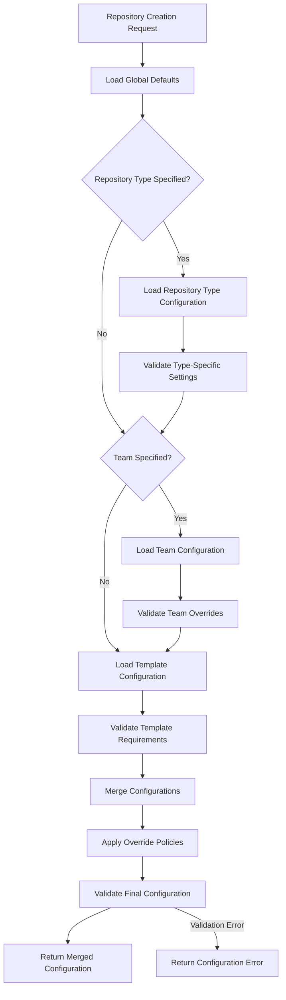

# Organization-Specific Repository Settings Design

## Overview

The organization-specific repository settings system provides a comprehensive configuration management framework that allows organizations to define baseline policies, teams to customize their workflows, and templates to specify their requirements. The system implements a hierarchical configuration model with sophisticated override controls and caching strategies.

## Architecture

### Core Components

The organization settings system consists of several interconnected components:

```rust
pub struct OrganizationSettingsManager {
    configuration_cache: Arc<RwLock<ConfigurationCache>>,
    merger: Arc<ConfigurationMerger>,
    metadata_provider: Arc<dyn MetadataRepositoryProvider>,
    schema_validator: Arc<dyn ConfigurationValidator>,
}

pub struct ConfigurationContext {
    created_at: chrono::DateTime<chrono::Utc>,
    organization: String,
    team: Option<String>,
    repository_type: Option<String>,
    template: String,
}

pub struct MergedConfiguration {
    branch_protection: BranchProtectionSettings,
    github_apps: Vec<GitHubAppConfig>,
    labels: HashMap<String, LabelConfig>,
    pull_request_settings: PullRequestSettings,
    repository_settings: RepositorySettings,
    source_trace: ConfigurationSourceTrace,
    webhooks: Vec<WebhookConfig>,
}
```

### Configuration Flow Architecture

The configuration resolution follows a structured workflow:



## Implementation Details

### Metadata Repository Provider

The metadata provider abstracts access to organization configuration repositories:

```rust
#[async_trait]
pub trait MetadataRepositoryProvider: Send + Sync {
    async fn discover_metadata_repository(&self, org: &str) -> Result<MetadataRepository, Error>;
    async fn list_available_repository_types(&self, repo: &MetadataRepository) -> Result<Vec<String>, Error>;
    async fn load_global_defaults(&self, repo: &MetadataRepository) -> Result<GlobalDefaults, Error>;
    async fn load_repository_type_configuration(&self, repo: &MetadataRepository, repo_type: &str) -> Result<Option<RepositoryTypeConfig>, Error>;
    async fn load_standard_labels(&self, repo: &MetadataRepository) -> Result<HashMap<String, LabelConfig>, Error>;
    async fn load_team_configuration(&self, repo: &MetadataRepository, team: &str) -> Result<Option<TeamConfig>, Error>;
    async fn validate_repository_structure(&self, repo: &MetadataRepository) -> Result<(), Error>;
}

#[derive(Debug, Clone)]
pub struct MetadataRepository {
    pub discovery_method: DiscoveryMethod,
    pub last_updated: chrono::DateTime<chrono::Utc>,
    pub organization: String,
    pub repository_name: String,
}

#[derive(Debug, Clone)]
pub enum DiscoveryMethod {
    ConfigurationBased { repository_name: String },
    TopicBased { topic: String },
}
```

### Configuration Structures

The system uses strongly-typed configuration structures with override controls:

```rust
#[derive(Deserialize, Serialize, Debug, Clone)]
pub struct OverridableValue<T> {
    pub override_allowed: bool,
    pub value: T,
}
```

**Flexible Deserialization**: `OverridableValue<T>` supports two TOML formats through custom deserialization:

1. **Explicit format** (for GlobalDefaults):

   ```toml
   setting = { value = true, override_allowed = false }
   ```

2. **Simple format** (for Team/RepositoryType/Template configs):

   ```toml
   setting = true
   ```

   The simple format automatically wraps the value with `override_allowed = true`.

This allows all configuration levels to use the same setting types (`RepositorySettings`, `PullRequestSettings`, etc.) while supporting different TOML syntaxes. GlobalDefaults uses explicit format to control override policies, while Team/RepositoryType/Template configs use simple format since they're doing the overriding.

```rust
#[derive(Deserialize, Serialize, Debug, Clone)]
pub struct GlobalDefaults {
    pub actions: Option<ActionSettings>,
    pub branch_protection: Option<BranchProtectionSettings>,
    pub custom_properties: Option<Vec<CustomProperty>>,
    pub environments: Option<Vec<EnvironmentConfig>>,
    pub github_apps: Option<Vec<GitHubAppConfig>>,
    pub pull_requests: Option<PullRequestSettings>,
    pub push: Option<PushSettings>,
    pub repository: Option<RepositorySettings>,
    pub webhooks: Option<Vec<WebhookConfig>>,
}

#[derive(Deserialize, Serialize, Debug, Clone)]
pub struct RepositorySettings {
    pub auto_close_issues: Option<OverridableValue<bool>>,
    pub discussions: Option<OverridableValue<bool>>,
    pub issues: Option<OverridableValue<bool>>,
    pub pages: Option<OverridableValue<bool>>,
    pub projects: Option<OverridableValue<bool>>,
    pub security_advisories: Option<OverridableValue<bool>>,
    pub vulnerability_reporting: Option<OverridableValue<bool>>,
    pub wiki: Option<OverridableValue<bool>>,
}
```

### Configuration Merger

The merger implements the hierarchical configuration logic:

```rust
impl ConfigurationMerger {
    fn apply_team_overrides(
        &self,
        merged: &mut MergedConfiguration,
        team: &TeamConfig,
        global: &GlobalDefaults,
        source_trace: &mut ConfigurationSourceTrace,
    ) -> Result<(), ConfigurationError> {
        // Repository settings overrides
        if let (Some(team_repo), Some(global_repo)) = (&team.repository, &global.repository) {
            self.merge_repository_settings(&mut merged.repository_settings, team_repo, global_repo, source_trace)?;
        }

        // Pull request settings overrides
        if let (Some(team_pr), Some(global_pr)) = (&team.pull_requests, &global.pull_requests) {
            self.merge_pull_request_settings(&mut merged.pull_request_settings, team_pr, global_pr, source_trace)?;
        }

        // Additive merging for collections
        if let Some(team_webhooks) = &team.webhooks {
            merged.webhooks.extend_from_slice(team_webhooks);
            source_trace.add_source("webhooks", ConfigurationSource::Team);
        }

        Ok(())
    }

    pub fn merge_configurations(
        &self,
        global: &GlobalDefaults,
        team: Option<&TeamConfig>,
        template: &TemplateConfig,
        context: &ConfigurationContext,
    ) -> Result<MergedConfiguration, ConfigurationError> {
        let mut merged = MergedConfiguration::new();
        let mut source_trace = ConfigurationSourceTrace::new();

        // Start with global defaults
        self.apply_global_defaults(&mut merged, global, &mut source_trace)?;

        // Apply team overrides if specified
        if let Some(team_config) = team {
            self.apply_team_overrides(&mut merged, team_config, global, &mut source_trace)?;
        }

        // Apply template configuration (highest precedence)
        self.apply_template_configuration(&mut merged, template, &mut source_trace)?;

        // Validate final configuration
        self.validate_final_configuration(&merged, context)?;

        merged.source_trace = source_trace;
        Ok(merged)
    }

    fn merge_repository_settings(
        &self,
        target: &mut RepositorySettings,
        team: &RepositorySettings,
        global: &RepositorySettings,
        source_trace: &mut ConfigurationSourceTrace,
    ) -> Result<(), ConfigurationError> {
        // Issues setting
        if let Some(team_issues) = &team.issues {
            if let Some(global_issues) = &global.issues {
                if !global_issues.override_allowed {
                    return Err(ConfigurationError::OverrideNotAllowed {
                        field: "repository.issues".to_string(),
                        attempted_value: team_issues.value.to_string(),
                        policy: "Global policy prohibits override".to_string(),
                    });
                }
            }
            target.issues = Some(team_issues.clone());
            source_trace.add_source("repository.issues", ConfigurationSource::Team);
        }

        // Similar logic for other fields...
        Ok(())
    }
}
```

### Configuration Caching

Intelligent caching improves performance while maintaining consistency:

```rust
#[derive(Debug)]
pub struct ConfigurationCache {
    cache_ttl: std::time::Duration,
    global_defaults: HashMap<String, CachedGlobalDefaults>,
    metadata_repositories: HashMap<String, CachedMetadataRepository>,
    team_configs: HashMap<String, CachedTeamConfig>,
    repository_type_configs: HashMap<String, CachedRepositoryTypeConfig>,
    template_configs: HashMap<String, CachedTemplateConfig>,
}

#[derive(Debug, Clone)]
pub struct CachedGlobalDefaults {
    pub cached_at: chrono::DateTime<chrono::Utc>,
    pub defaults: GlobalDefaults,
    pub repository_version: String, // Git commit hash or similar
}

impl ConfigurationCache {
    pub fn get_global_defaults(&self, org: &str) -> Option<&GlobalDefaults> {
        if let Some(cached) = self.global_defaults.get(org) {
            if chrono::Utc::now() - cached.cached_at < self.cache_ttl {
                return Some(&cached.defaults);
            }
        }
        None
    }

    pub fn invalidate_organization(&mut self, org: &str) {
        self.global_defaults.remove(org);
        // Remove all team configs for this organization
        self.team_configs.retain(|key, _| !key.starts_with(&format!("{}/", org)));
        self.metadata_repositories.remove(org);
    }

    pub fn invalidate_team(&mut self, org: &str, team: &str) {
        let team_key = format!("{}/{}", org, team);
        self.team_configs.remove(&team_key);
    }
}
```

### Configuration Validation

Comprehensive validation ensures configuration integrity:

```rust
#[async_trait]
pub trait ConfigurationValidator: Send + Sync {
    async fn validate_global_defaults(&self, defaults: &GlobalDefaults) -> Result<ValidationResult, Error>;
    async fn validate_merged_config(&self, merged: &MergedConfiguration) -> Result<ValidationResult, Error>;
    async fn validate_repository_type_config(&self, config: &RepositoryTypeConfig, global: &GlobalDefaults) -> Result<ValidationResult, Error>;
    async fn validate_team_config(&self, config: &TeamConfig, global: &GlobalDefaults) -> Result<ValidationResult, Error>;
    async fn validate_template_config(&self, config: &TemplateConfig) -> Result<ValidationResult, Error>;
}

#[derive(Debug)]
pub struct ValidationResult {
    pub errors: Vec<ValidationError>,
    pub is_valid: bool,
    pub warnings: Vec<ValidationWarning>,
}

#[derive(Debug, Clone)]
pub struct ValidationError {
    pub error_type: ValidationErrorType,
    pub field_path: String,
    pub message: String,
    pub suggestion: Option<String>,
}

#[derive(Debug, Clone)]
pub enum ValidationErrorType {
    BusinessRuleViolation,
    InvalidValue,
    OverrideNotAllowed,
    RequiredFieldMissing,
    SchemaViolation,
}
```

## Configuration File Formats

### Global Defaults Format

Organization-wide settings with override controls:

```toml
# global/defaults.toml

[repository]
issues = { value = true, override_allowed = true }
projects = { value = false, override_allowed = true }
discussions = { value = true, override_allowed = true }
wiki = { value = true, override_allowed = true }
security_advisories = { value = true, override_allowed = false }  # Security policy
vulnerability_reporting = { value = true, override_allowed = false }  # Security policy

[pull_requests]
allow_merge_commit = { value = false, override_allowed = true }
allow_squash_merge = { value = true, override_allowed = true }
required_approving_review_count = { value = 1, override_allowed = true }
require_conversation_resolution = { value = true, override_allowed = false }  # Quality policy

[branch_protection]
default_branch = { value = "main", override_allowed = true }
require_pull_request_reviews = { value = true, override_allowed = false }  # Security policy
restrict_pushes = { value = true, override_allowed = false }

# Required GitHub Apps for all repositories
[[github_apps]]
app_id = 12345
permissions = { issues = "read", pull_requests = "write" }
override_allowed = false  # Required for compliance

[[github_apps]]
app_id = 67890
permissions = { actions = "read" }
override_allowed = true  # Teams can choose to enable
```

### Team Configuration Format

Team-specific overrides and additions:

```toml
# teams/backend-team/config.toml

[repository]
discussions = false  # Override global default
projects = true      # Override global default

[pull_requests]
required_approving_review_count = 2  # Override global default
require_code_owner_reviews = true
allow_auto_merge = true

# Team-specific webhooks
[[webhooks]]
url = "https://backend-team.example.com/webhook"
content_type = "json"
events = ["push", "pull_request"]
active = true

# Team-specific GitHub Apps
[[github_apps]]
app_id = 11111
permissions = { contents = "read", issues = "write" }

# Team-specific environments
[[environments]]
name = "staging"
protection_rules = { required_reviewers = ["@backend-team"], wait_timer = 0 }
```

### Repository Type Configuration Format

Type-specific settings that apply to repositories of a particular type:

```toml
# types/documentation/config.toml

[repository]
wiki = { value = false, override_allowed = true }  # Documentation is in repository
issues = { value = true, override_allowed = true }  # For feedback
projects = { value = false, override_allowed = true }  # Usually not needed

[pull_requests]
required_approving_review_count = { value = 1, override_allowed = true }
require_conversation_resolution = { value = true, override_allowed = false }

# Documentation-specific labels
[[labels]]
name = "documentation"
color = "0052cc"
description = "Improvements or additions to documentation"

[[labels]]
name = "typo"
color = "d4c5f9"
description = "Typographical errors"
```

```toml
# types/actions/config.toml

[repository]
issues = { value = true, override_allowed = true }
projects = { value = false, override_allowed = true }
wiki = { value = false, override_allowed = true }

[pull_requests]
required_approving_review_count = { value = 2, override_allowed = false }  # Marketplace compliance
require_code_owner_reviews = { value = true, override_allowed = false }

[branch_protection]
required_status_checks = { value = ["test", "lint", "security-scan"], override_allowed = false }

# Actions-specific labels
[[labels]]
name = "breaking-change"
color = "d73a4a"
description = "Breaking changes to action interface"

[[labels]]
name = "enhancement"
color = "a2eeef"
description = "New feature or request"
```

```toml
# types/library/config.toml

[repository]
security_advisories = { value = true, override_allowed = false }
vulnerability_reporting = { value = true, override_allowed = false }
issues = { value = true, override_allowed = true }
wiki = { value = false, override_allowed = true }

[pull_requests]
required_approving_review_count = { value = 2, override_allowed = true }
require_code_owner_reviews = { value = true, override_allowed = false }
require_conversation_resolution = { value = true, override_allowed = false }

[branch_protection]
required_status_checks = { value = ["test", "lint", "security-scan", "coverage"], override_allowed = true }
restrict_pushes = { value = true, override_allowed = false }

# Library-specific environments for publishing
[[environments]]
name = "production"
protection_rules = { required_reviewers = ["@library-maintainers"], wait_timer = 300 }
```

### Template Configuration Format

Template-specific requirements and settings:

```toml
# .reporoller/template.toml

[template]
name = "rust-microservice"
description = "Production-ready Rust microservice"
author = "Platform Team"
tags = ["rust", "microservice", "backend"]

# Repository type specification
[repository_type]
type = "service"  # The repository type this template creates
policy = "fixed"  # "fixed" or "preferable" - controls user override capability
# policy = "preferable"  # Alternative: user can override during creation

[repository]
wiki = false  # Templates override team/global
security_advisories = true

[pull_requests]
required_approving_review_count = 2
require_code_owner_reviews = true

# Template variables
[variables]
service_name = { description = "Name of the microservice", example = "user-service" }
service_port = { description = "Port the service runs on", default = "8080" }
team_name = { description = "Owning team name", example = "backend-team" }

# Template-specific GitHub Apps
[[github_apps]]
app_id = 55555  # Deployment app
permissions = { actions = "write", deployments = "write" }
```

```toml
# .reporoller/template.toml - Documentation template example

[template]
name = "documentation-site"
description = "Documentation website template"
author = "Documentation Team"
tags = ["documentation", "website"]

# Repository type specification with user choice
[repository_type]
type = "documentation"  # Default/preferred type
policy = "preferable"   # User can override during repository creation

[repository]
wiki = false  # Documentation is in the repository
issues = true  # For feedback
projects = false

[variables]
site_name = { description = "Name of the documentation site", example = "API Documentation" }
base_url = { description = "Base URL for the site", example = "https://docs.example.com" }
```

## Security Considerations

### Override Policy Enforcement

- **Immutable Security Policies**: Security-critical settings marked as non-overridable cannot be changed
- **Hierarchical Validation**: All override attempts validated against global policies
- **Audit Logging**: All configuration merges and override attempts logged
- **Permission Boundaries**: Configuration access respects GitHub App permission boundaries

### Data Protection

- **Cache Security**: Cached configurations protected against unauthorized access
- **Repository Access**: Metadata repository access authenticated through GitHub App
- **Sensitive Data**: No sensitive credentials stored in configuration files
- **Access Logging**: All configuration repository access logged for audit

## Performance Optimizations

### Caching Strategy

- **Multi-Level Caching**: Global, team, and template configurations cached separately
- **TTL Management**: Configurable cache TTL with intelligent invalidation
- **Concurrent Access**: Thread-safe cache implementation for high concurrency
- **Memory Optimization**: LRU eviction for large organizations with many teams

### Loading Optimization

- **Lazy Loading**: Team configurations loaded only when needed
- **Batch Operations**: Multiple configuration files loaded in parallel
- **Incremental Updates**: Only changed configurations reloaded on updates
- **Dependency Tracking**: Cache dependencies tracked for intelligent invalidation

## Error Handling and Recovery

### Configuration Loading Errors

1. **Repository Discovery Failures**
   - Fallback to cached metadata repository information
   - Clear error messages for configuration issues
   - Retry logic with exponential back-off for transient failures

2. **Schema Validation Failures**
   - Detailed error reporting with line numbers and field paths
   - Suggestions for common configuration mistakes
   - Graceful degradation using global defaults when possible

3. **Override Policy Violations**
   - Clear explanation of policy restrictions
   - Identification of conflicting settings and their sources
   - Guidance on obtaining necessary permissions or policy changes

### Cache Consistency

1. **Cache Invalidation**
   - Real-time invalidation on metadata repository changes
   - Coordination across multiple application instances
   - Graceful handling of cache invalidation failures

2. **Stale Data Handling**
   - Automatic refresh of expired cache entries
   - Fallback to repository access when cache is unavailable
   - Consistency checks for critical configuration changes

## Integration Points

### Repository Creation Workflow

The configuration system integrates seamlessly with repository creation:

1. **Pre-Creation Configuration**: Configuration resolved before repository creation begins
2. **Settings Application**: Merged configuration applied to repository via GitHub API
3. **Post-Creation Actions**: Template post-creation actions executed with resolved settings
4. **Error Recovery**: Configuration errors prevent repository creation from starting

### GitHub API Integration

Efficient mapping from configuration to GitHub API calls:

1. **Settings Mapping**: Configuration fields mapped to appropriate GitHub API endpoints
2. **Batch Operations**: Multiple settings updated in coordinated API calls
3. **Rate Limiting**: Configuration application respects GitHub API rate limits
4. **Error Handling**: API failures handled with appropriate retry and recovery logic

## Testing Strategy

### Unit Testing

- **Configuration Merging**: Comprehensive tests for all merge scenarios
- **Override Validation**: Tests for all override policy enforcement scenarios
- **Cache Behavior**: Tests for cache hits, misses, and invalidation
- **Error Conditions**: Tests for all error conditions and edge cases

### Integration Testing

- **End-to-End Configuration**: Complete configuration loading and merging workflows
- **GitHub Integration**: Tests with real metadata repositories and GitHub API
- **Performance Testing**: Cache performance and concurrent access validation
- **Repository Structure**: Validation of metadata repository structure requirements

## Acceptance Criteria

### Core Functionality

1. **Configuration Hierarchy**: Three-level hierarchy correctly implemented and enforced
2. **Override Controls**: Override policies respected and enforced consistently
3. **Metadata Repository**: Multiple discovery methods work correctly
4. **Configuration Merging**: Deterministic and correct merging for all scenarios

### Performance

1. **Cache Performance**: Configuration loading meets performance requirements
2. **Concurrent Access**: System handles concurrent repository creation efficiently
3. **Memory Usage**: Cache memory usage remains within acceptable bounds
4. **API Efficiency**: GitHub API usage optimized for configuration operations

### Security and Reliability

1. **Override Enforcement**: Security policies cannot be bypassed
2. **Access Control**: Configuration access properly authenticated and authorized
3. **Audit Trail**: All configuration operations logged for security audit
4. **Error Recovery**: Graceful handling of all failure scenarios

## Configuration Type Definitions

### Repository Type Configuration Structure

```rust
#[derive(Deserialize, Serialize, Debug, Clone)]
pub struct RepositoryTypeConfig {
    pub branch_protection: Option<BranchProtectionSettings>,
    pub custom_properties: Option<Vec<CustomProperty>>,
    pub environments: Option<Vec<EnvironmentConfig>>,
    pub github_apps: Option<Vec<GitHubAppConfig>>,
    pub labels: Option<Vec<LabelConfig>>,
    pub pull_requests: Option<PullRequestSettings>,
    pub repository: Option<RepositorySettings>,
    pub webhooks: Option<Vec<WebhookConfig>>,
}

#[derive(Debug, Clone)]
pub struct CachedRepositoryTypeConfig {
    pub cached_at: chrono::DateTime<chrono::Utc>,
    pub config: RepositoryTypeConfig,
    pub repository_version: String,
}

#[derive(Deserialize, Serialize, Debug, Clone)]
pub struct RepositoryTypeDefinition {
    pub config_path: String,
    pub description: String,
    pub examples: Vec<String>,
    pub name: String,
}
```

### Template Configuration Structure

```rust
#[derive(Deserialize, Serialize, Debug, Clone)]
pub struct TemplateConfig {
    pub branch_protection: Option<BranchProtectionSettings>,
    pub environments: Option<Vec<EnvironmentConfig>>,
    pub github_apps: Option<Vec<GitHubAppConfig>>,
    pub labels: Option<Vec<LabelConfig>>,
    pub pull_requests: Option<PullRequestSettings>,
    pub repository_type: Option<RepositoryTypeSpec>,
    pub repository: Option<RepositorySettings>,
    pub template: TemplateMetadata,
    pub variables: Option<HashMap<String, TemplateVariable>>,
    pub webhooks: Option<Vec<WebhookConfig>>,
}

#[derive(Deserialize, Serialize, Debug, Clone)]
pub struct TemplateMetadata {
    pub author: String,
    pub description: String,
    pub name: String,
    pub tags: Vec<String>,
}

#[derive(Deserialize, Serialize, Debug, Clone)]
pub struct RepositoryTypeSpec {
    pub policy: RepositoryTypePolicy,  // Whether user can override
    pub repository_type: String,           // The repository type this template creates
}

#[derive(Deserialize, Serialize, Debug, Clone)]
pub enum RepositoryTypePolicy {
    #[serde(rename = "fixed")]
    Fixed,        // User cannot override the repository type
    #[serde(rename = "preferable")]
    Preferable,   // User can override during repository creation
}

#[derive(Deserialize, Serialize, Debug, Clone)]
pub struct TemplateVariable {
    pub default: Option<String>,
    pub description: String,
    pub example: Option<String>,
    pub required: Option<bool>,
}

#[derive(Debug, Clone)]
pub struct CachedTemplateConfig {
    pub cached_at: chrono::DateTime<chrono::Utc>,
    pub config: TemplateConfig,
    pub template_version: String,
}
```

### Repository Type Management

```rust
impl OrganizationSettingsManager {
    async fn apply_repository_type_overrides(
        &self,
        merged: &mut MergedConfiguration,
        repo_type_config: &RepositoryTypeConfig,
        global: &GlobalDefaults,
        source_trace: &mut ConfigurationSourceTrace,
    ) -> Result<(), ConfigurationError> {
        // Repository settings overrides
        if let (Some(type_repo), Some(global_repo)) = (&repo_type_config.repository, &global.repository) {
            self.merger.merge_repository_settings(&mut merged.repository_settings, type_repo, global_repo, source_trace)?;
        }

        // Pull request settings overrides
        if let (Some(type_pr), Some(global_pr)) = (&repo_type_config.pull_requests, &global.pull_requests) {
            self.merger.merge_pull_request_settings(&mut merged.pull_request_settings, type_pr, global_pr, source_trace)?;
        }

        // Additive merging for collections
        if let Some(type_labels) = &repo_type_config.labels {
            merged.labels.extend(type_labels.iter().map(|l| (l.name.clone(), l.clone())));
            source_trace.add_source("labels", ConfigurationSource::RepositoryType);
        }

        if let Some(type_webhooks) = &repo_type_config.webhooks {
            merged.webhooks.extend_from_slice(type_webhooks);
            source_trace.add_source("webhooks", ConfigurationSource::RepositoryType);
        }

        Ok(())
    }

    /// Set repository type as GitHub custom property
    async fn apply_repository_type_property(
        &self,
        repository_full_name: &str,
        repository_type: Option<&str>,
    ) -> Result<(), Error> {
        if let Some(repo_type) = repository_type {
            // Create custom property for repository type
            let custom_property = CustomProperty {
                property_name: "repository_type".to_string(),
                value: CustomPropertyValue::SingleSelect(repo_type.to_string()),
            };

            // Apply to repository via GitHub API
            self.github_client
                .set_repository_custom_property(repository_full_name, &custom_property)
                .await?;
        }
        Ok(())
    }

    async fn load_repository_type_configuration(
        &self,
        context: &ConfigurationContext,
    ) -> Result<Option<RepositoryTypeConfig>, Error> {
        if let Some(repo_type) = &context.repository_type {
            // Check cache first
            if let Some(cached) = self.configuration_cache
                .read()
                .await
                .get_repository_type_config(&context.organization, repo_type) {
                return Ok(Some(cached.clone()));
            }

            // Load from metadata repository
            let metadata_repo = self.metadata_provider
                .discover_metadata_repository(&context.organization)
                .await?;

            let config = self.metadata_provider
                .load_repository_type_configuration(&metadata_repo, repo_type)
                .await?;

            // Cache the result
            if let Some(ref config) = config {
                self.configuration_cache
                    .write()
                    .await
                    .insert_repository_type_config(
                        &context.organization,
                        repo_type,
                        config.clone(),
                    );
            }

            Ok(config)
        } else {
            Ok(None)
        }
    }

    /// Resolve repository type from template specification and user override
    async fn resolve_repository_type(
        &self,
        template_config: &TemplateConfig,
        user_override: Option<&str>,
    ) -> Result<Option<String>, ConfigurationError> {
        if let Some(repo_type_spec) = &template_config.repository_type {
            match repo_type_spec.policy {
                RepositoryTypePolicy::Fixed => {
                    // Template enforces the repository type - user cannot override
                    if user_override.is_some() && user_override != Some(&repo_type_spec.repository_type) {
                        return Err(ConfigurationError::RepositoryTypeOverrideNotAllowed {
                            template_type: repo_type_spec.repository_type.clone(),
                            attempted_override: user_override.unwrap().to_string(),
                            template_name: template_config.template.name.clone(),
                        });
                    }
                    Ok(Some(repo_type_spec.repository_type.clone()))
                }
                RepositoryTypePolicy::Preferable => {
                    // User can override, but template provides default
                    Ok(Some(user_override.unwrap_or(&repo_type_spec.repository_type).to_string()))
                }
            }
        } else {
            // Template doesn't specify repository type - use user override if provided
            Ok(user_override.map(|s| s.to_string()))
        }
    }
}

#[derive(Debug, Clone)]
pub enum ConfigurationSource {
    Global,
    RepositoryType,
    Team,
    Template,
}

#[derive(Debug, thiserror::Error)]
pub enum ConfigurationError {
    #[error("Override not allowed for field '{field}': {policy}")]
    OverrideNotAllowed {
        field: String,
        attempted_value: String,
        policy: String,
    },
    #[error("Repository type override not allowed: template '{template_name}' fixes type to '{template_type}', cannot override to '{attempted_override}'")]
    RepositoryTypeOverrideNotAllowed {
        template_type: String,
        attempted_override: String,
        template_name: String,
    },
    #[error("Repository type '{repo_type}' not found in organization configuration")]
    RepositoryTypeNotFound { repo_type: String },
    #[error("Configuration validation failed: {message}")]
    ValidationFailed { message: String },
}
```

## Behavioral Assertions

1. Configuration hierarchy must be consistently enforced - template always overrides team, team overrides repository type, repository type overrides global
2. Override policies marked as non-overridable must never be violated regardless of configuration source
3. Configuration merging must be deterministic - same inputs always produce identical outputs
4. Cache invalidation must be immediate and consistent across all application instances
5. Team configurations must only apply to repositories created for that specific team
6. Repository type configurations must only apply to repositories explicitly assigned that type
7. Repository type assignment must be optional - repositories without a type use only global/team/template settings
8. Configuration validation must catch all schema violations before repository creation begins
9. Metadata repository structure validation must ensure all required files and directories exist
10. Override audit trails must be maintained for all configuration merge operations
11. Configuration loading must be atomic - either all configurations load successfully or operation fails
12. Security-critical settings must be enforceable at organization level without exception
13. Concurrent repository creation must not interfere with configuration caching or loading
14. Template configuration validation must verify compatibility with organization policies
15. Repository type custom properties must be automatically applied to repositories of that type
16. Repository type configurations must validate against global override policies before application
17. Repository type definitions must be discoverable through metadata repository structure
18. Cache entries for repository type configurations must be invalidated when type definitions change
19. Templates with "fixed" repository type policy must prevent user overrides completely
20. Templates with "preferable" repository type policy must allow user overrides while providing defaults
21. Repository type custom properties must be set automatically upon repository creation
22. Template repository type validation must occur before repository creation begins
23. User repository type override attempts must be validated against template policies before acceptance
