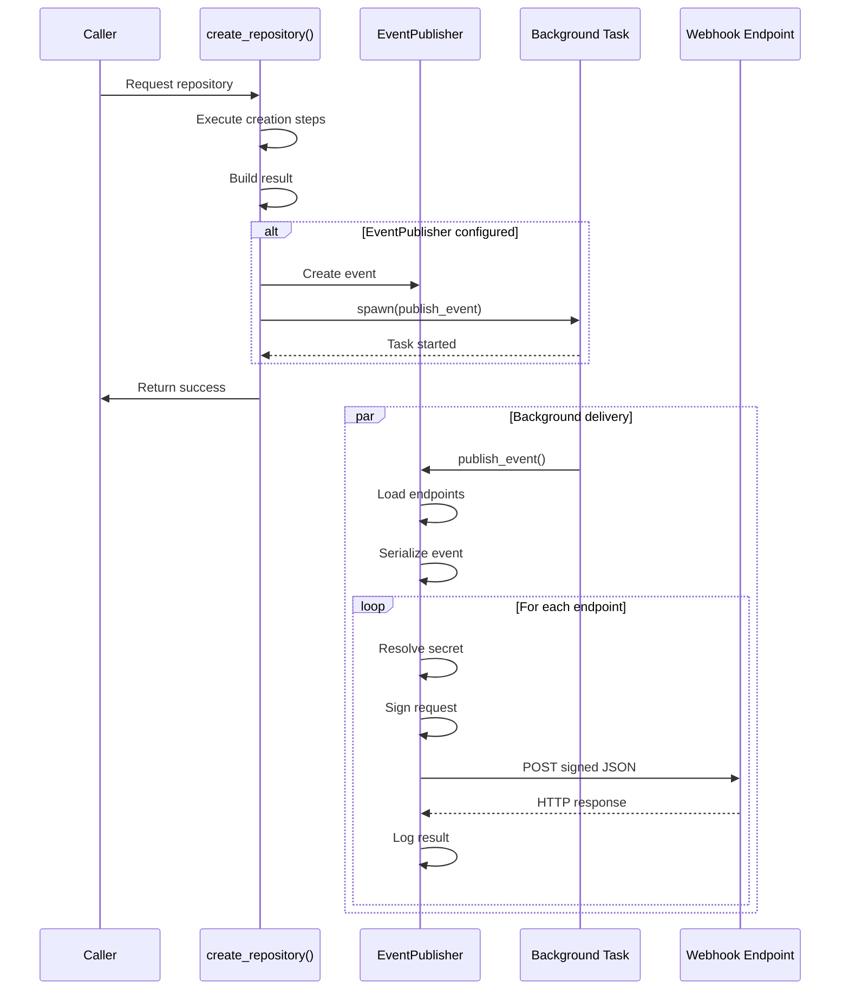
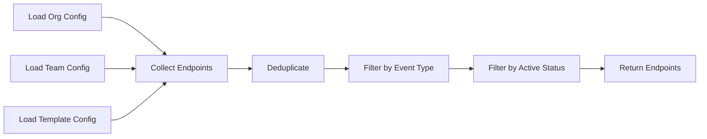

# Outbound Event Notifications - Architectural Design

## Purpose

This document defines the architectural design for publishing outbound webhook notifications when RepoRoller creates repositories. It focuses on component responsibilities, boundaries, and integration points.

## Architectural Decisions

### AD-1: Asynchronous Fire-and-Forget Delivery

**Decision**: Event publication happens asynchronously in background tasks that do not block repository creation.

**Rationale**:

- Repository creation is the primary workflow; notifications are supplementary
- Network failures to webhook endpoints should not impact RepoRoller's core functionality
- Background delivery allows repository creation to return quickly to users
- Aligns with best-effort delivery model

**Consequences**:

- No delivery guarantees (best-effort only)
- No retry mechanisms in initial implementation
- Delivery failures logged but not propagated to caller
- Requires structured logging and metrics for observability

### AD-2: Multi-Level Configuration Accumulation

**Decision**: Notification endpoints are configured at organization, team, and template levels with additive accumulation.

**Rationale**:

- Matches RepoRoller's existing hierarchical configuration model
- Allows organization-wide notifications while enabling team/template-specific hooks
- Supports separation of concerns (central governance + team autonomy)
- Consistent with other configuration behaviors

**Consequences**:

- Endpoints from all levels are collected and combined
- Deduplication required to avoid duplicate notifications
- Configuration loading happens from multiple sources
- Teams can add their own endpoints without modifying org config

### AD-3: HMAC-SHA256 Request Signing

**Decision**: All webhook requests are signed using HMAC-SHA256 with shared secrets.

**Rationale**:

- Industry-standard approach (GitHub, Stripe, Twilio use HMAC signing)
- Allows recipients to verify request authenticity
- Prevents request spoofing and tampering
- Lightweight compared to asymmetric cryptography

**Consequences**:

- Shared secrets must be securely managed
- Recipients must implement signature verification
- Clock skew could cause verification issues (mitigated by timestamp inclusion)
- Signature computation adds minimal latency

### AD-4: Container-Native Secret Management

**Decision**: Webhook secrets are provided through standard container secret mechanisms (environment variables, volume mounts, managed identities).

**Rationale**:

- Follows cloud-native best practices
- Works across Azure (Key Vault + managed identities) and AWS (Secrets Manager + IAM roles)
- Supports Kubernetes secrets, Docker secrets, etc.
- Avoids vendor lock-in to specific secret storage

**Consequences**:

- Configuration references secrets by name/key, not direct values
- Secret resolution happens at runtime from environment
- Supports multiple secret sources without code changes
- Requires proper secret injection in deployment manifests

**Implementation Approaches**:

- **Azure**: Managed Identity → Key Vault
- **AWS**: IAM Role → Secrets Manager
- **Kubernetes**: Secret volume mounts or CSI drivers
- **Local Dev**: Environment variables

### AD-5: Event Publisher as Business Logic Component

**Decision**: EventPublisher is a business logic component (domain layer), not infrastructure.

**Rationale**:

- Event publication is a domain concern (part of repository creation workflow)
- Orchestrates multiple collaborators (ConfigurationManager, HTTP client, MetricsCollector)
- Enforces business rules (endpoint validation, event filtering, deduplication)
- Follows hexagonal architecture principles

**Consequences**:

- EventPublisher depends on abstractions, not concrete implementations
- HTTP delivery details encapsulated behind clean interface
- Easy to test with mock collaborators
- Can be extended with additional event types without infrastructure changes

## Component Boundaries

### Business Logic (Domain Layer)

**EventPublisher**

- **Knows**: Event schemas, endpoint configurations, delivery rules
- **Does**: Publishes events to configured endpoints, signs requests, logs results
- **Collaborators**:
  - ConfigurationManager (loads notification configs)
  - SecretResolver (retrieves signing secrets)
  - MetricsCollector (records delivery outcomes)
  - HTTP Client (sends requests)

**RepositoryCreatedEvent**

- **Knows**: Repository creation metadata, request context
- **Does**: Serializes to JSON payload
- **Collaborators**: None (pure data structure)

**NotificationEndpoint**

- **Knows**: URL, events, active status, timeout
- **Does**: Validates configuration, filters events
- **Collaborators**: None (value object)

### External System Interfaces (Abstractions)

**SecretResolver**

- **Contract**: Resolves secret references to actual values
- **Implementations**: EnvironmentSecretResolver, KeyVaultSecretResolver, SecretsManagerResolver

**MetricsCollector**

- **Contract**: Records delivery attempts, successes, failures, durations
- **Implementations**: PrometheusMetricsCollector, NoOpMetricsCollector

**ConfigurationManager** (existing)

- **Contract**: Loads notification configurations from metadata repository
- **Implementations**: MetadataRepositoryConfigurationManager

### Infrastructure Layer

**HTTP Client**

- Request building and execution
- Connection pooling
- Timeout enforcement

**Signature Computation**

- HMAC-SHA256 implementation
- Hex encoding

**Background Task Spawning**

- Tokio runtime integration

## Integration Points

### Repository Creation Workflow



**Key Points**:

- Event publication initiated AFTER repository creation succeeds
- Background task spawned immediately, returns control to caller
- Delivery happens independently of main workflow
- Failures logged but do not propagate

### Configuration Loading



**Hierarchy**:

1. Organization: `.reporoller/global/notifications.toml`
2. Team: `.reporoller/teams/{team}/notifications.toml`
3. Template: `.reporoller/notifications.toml` (in template repo)

**Accumulation**: All endpoints from all levels are combined (additive)
**Deduplication**: Based on `(url, event_type)` tuple

## Event Schema

### RepositoryCreatedEvent Structure

**Core Fields**:

- `event_type`: Always `"repository.created"`
- `event_id`: Unique UUID v4 for this event
- `timestamp`: ISO 8601 UTC timestamp

**Repository Metadata**:

- `organization`: GitHub org name
- `repository_name`: Repo name
- `repository_url`: Full HTTPS URL
- `repository_id`: GitHub node ID
- `visibility`: `"public"`, `"private"`, or `"internal"`

**Request Context**:

- `created_by`: User who requested creation
- `repository_type`: Type classification (optional)
- `template_name`: Template used (optional, null for empty repos)
- `content_strategy`: `"template"`, `"empty"`, or `"custom_init"`
- `team`: Team name (optional)
- `description`: Repository description (optional)

**Applied Configuration**:

- `custom_properties`: Map of custom properties applied
- `applied_settings`: Repository settings (issues, wiki, projects, discussions)

### Configuration Schema

**NotificationEndpoint**:

```toml
[[outbound_webhooks]]
url = "https://example.com/webhook"
secret = "SECRET_NAME"  # Reference to secret in environment/vault
events = ["repository.created"]
active = true
timeout_seconds = 5
description = "Production deployment system"
```

**Secret References**:

- `"SECRET_NAME"` → Environment variable lookup
- `"WEBHOOK_SECRET_1"` → Kubernetes secret mount
- Secret resolution is environment-specific (no hardcoded values in config)

## Security Model

### Request Signing

**Algorithm**: HMAC-SHA256
**Header**: `X-RepoRoller-Signature-256`
**Format**: `sha256=<hex-encoded-signature>`

**Computation**:

1. Serialize event to JSON bytes
2. Compute HMAC-SHA256(payload, secret)
3. Hex-encode result
4. Add header to request

**Verification** (recipient-side):

1. Extract signature from header
2. Recompute HMAC-SHA256(body, shared_secret)
3. Constant-time compare expected vs. actual
4. Reject if mismatch

### Secret Management

**Storage**: Secrets NEVER appear in configuration files
**References**: Configuration contains secret identifiers, not values
**Resolution**: At runtime from container environment

**Supported Mechanisms**:

- **Environment Variables**: `WEBHOOK_SECRET_PROD`, etc.
- **Volume Mounts**: `/secrets/webhook-secret` (Kubernetes, Docker)
- **Managed Identities**: Azure Key Vault via workload identity
- **IAM Roles**: AWS Secrets Manager via task role

**Example Deployment Configurations**:

*Azure Container Apps*:

```yaml
secretStoreComponent: azurekeyvault
secrets:
  - name: webhook-secret-prod
    keyVaultUrl: https://myvault.vault.azure.net/secrets/webhook-prod
```

*AWS ECS*:

```json
{
  "secrets": [
    {
      "name": "WEBHOOK_SECRET_PROD",
      "valueFrom": "arn:aws:secretsmanager:region:account:secret:webhook-prod"
    }
  ]
}
```

*Kubernetes*:

```yaml
volumeMounts:
  - name: webhook-secrets
    mountPath: /secrets
    readOnly: true
volumes:
  - name: webhook-secrets
    secret:
      secretName: reporoller-webhook-secrets
```

### TLS Requirements

- All webhook URLs must use HTTPS (HTTP rejected at validation)
- TLS certificate validation enforced
- No certificate pinning (standard CA trust)

## Error Handling Strategy

### Failure Isolation

**Principle**: Notification failures MUST NOT cause repository creation to fail.

**Failure Modes**:

| Failure | Response | Log Level |
|---------|----------|-----------|
| Configuration load error | Skip all notifications | WARN |
| Invalid endpoint config | Skip invalid endpoint | WARN |
| Secret resolution error | Skip endpoint | WARN |
| Event serialization error | Skip all notifications | ERROR |
| Background task spawn error | Skip all notifications | ERROR |
| Network timeout | Log failure, continue | WARN |
| HTTP 4xx/5xx | Log status code, continue | WARN |
| DNS resolution error | Log error, continue | WARN |

**No Retries**: Initial implementation uses fire-and-forget (retries in future enhancement)

### Observability

**Structured Logging** (tracing crate):

- INFO: Event publication started/completed, endpoint delivery outcomes
- WARN: Delivery failures, configuration issues
- ERROR: System failures (serialization, task spawn)

**Metrics** (Prometheus):

- `notification_delivery_attempts_total` (counter)
- `notification_delivery_successes_total` (counter)
- `notification_delivery_failures_total` (counter)
- `notification_delivery_duration_seconds` (histogram)
- `notification_active_tasks` (gauge)

## Testing Strategy

### Unit Test Boundaries

**EventPublisher Tests**:

- Event creation from result/request
- Endpoint filtering by event type
- Endpoint deduplication logic
- Signature computation correctness

**NotificationEndpoint Tests**:

- Configuration validation (HTTPS requirement, timeout bounds)
- Event type filtering
- Active status checking

**Configuration Loading Tests**:

- Multi-level accumulation
- Deduplication logic
- Missing configuration handling

### Integration Test Approach

**Mock HTTP Server** (wiremock):

- Verify request structure (headers, body, signature)
- Test timeout enforcement
- Test error handling (4xx, 5xx, network errors)
- Verify no retries

**Mock ConfigurationManager**:

- Test endpoint loading from all levels
- Test missing configuration scenarios

**Mock SecretResolver**:

- Test secret resolution success/failure
- Test environment variable lookup
- Test error propagation

### E2E Test Strategy

**httpbin.org** (or similar):

- Verify actual HTTP delivery
- Confirm payload structure
- Validate signature headers

**Test Repositories**:

- Create test repos with notification configs
- Verify events published
- Confirm multi-level accumulation

## Implementation Phases

### Phase 1: Core Types and Configuration

- Define RepositoryCreatedEvent
- Define NotificationEndpoint and NotificationsConfig
- Implement configuration validation
- Implement multi-level loading and deduplication

### Phase 2: Secret Management

- Define SecretResolver abstraction
- Implement EnvironmentSecretResolver
- Document secret configuration patterns

### Phase 3: Event Publisher

- Implement EventPublisher component
- Implement HMAC-SHA256 signing
- Implement HTTP delivery with timeout
- Add structured logging

### Phase 4: Integration

- Add EventPublisher to create_repository workflow
- Implement background task spawning
- Add metrics collection

### Phase 5: Testing

- Unit tests for all components
- Integration tests with mocks
- E2E tests with real endpoints

### Phase 6: Documentation

- Configuration examples
- Signature verification guide for recipients
- Deployment configurations for Azure/AWS/Kubernetes

## Future Enhancements

**Out of Scope for Initial Implementation**:

- Retry logic with exponential backoff
- Dead letter queue for failed events
- Event replay mechanism
- Additional event types (updated, deleted)
- Batch delivery
- Circuit breaker pattern
- Per-endpoint rate limiting
- Webhook management UI

## References

- [Requirements Specification](../requirements/outbound-event-notifications.md)
- [Vocabulary Document](../vocabulary.md#event-publishing-domain)
- [Responsibilities Document](../responsibilities.md#eventpublisher)
- [Behavioral Assertions](../assertions.md#event-notification-assertions)
