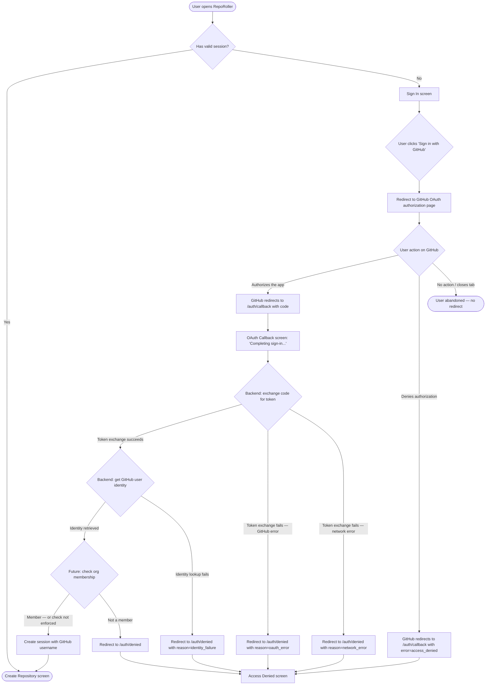

# Authentication Flow

## Overview

RepoRoller uses GitHub OAuth to establish user identity. The VPN provides access control;
OAuth provides the verified GitHub username that is recorded in the creation audit log.

Org membership is **not enforced at sign-in** in this release. The architecture is designed so
that a membership check can be added to the OAuth callback handler later without changes to
the front-end flow.

---

## User Goal: Sign in and reach the creation form

### Flow Diagram

---

## Session Lifecycle

| Event | Behaviour |
|---|---|
| Successful OAuth | Session cookie set (HTTP-only, Secure, SameSite=Lax); user redirected to `/create` |
| Session active | All requests to `/create` and `/create/success` proceed without re-authentication |
| Session expired (future) | User redirected to `/sign-in`; redirect back to `/create` after successful sign-in |
| User clicks Sign out | Session destroyed; user redirected to `/sign-in` |
| OAuth error or denial | Session not created; user redirected to `/auth/denied` with `reason` parameter |

---

## Assumptions

- Session management is handled by the SvelteKit backend (server-side sessions or signed cookies).
- GitHub OAuth App credentials (client ID, client secret) are configured at deployment.
- The `read:user` scope is requested to retrieve the GitHub login (`GET /user`).
- The `read:org` scope is requested to support future org membership checks without a re-auth flow.
- The OAuth callback URL registered with the GitHub App is `/auth/callback`.
