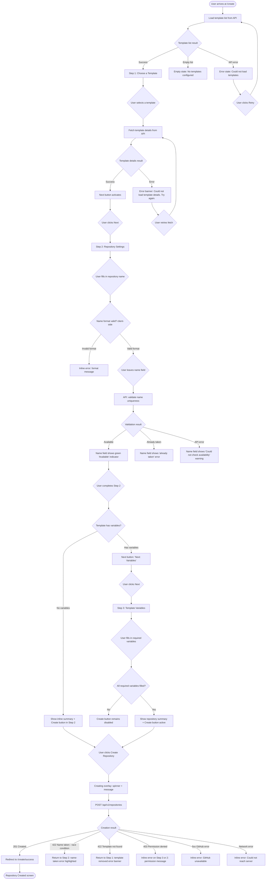

# Repository Creation Flow

## Overview

The repository creation flow is the primary function of the web UI. It walks the user through a
2–3 step wizard to select a template, configure the repository, supply template variables, and
submit the creation request. Step 3 (variables) is skipped when the selected template defines
no variables.

---

## User Goal: Create a fully-configured GitHub repository

### Happy Path Flow

---

## Step Structure

| Step | Name | Required for all flows |
|---|---|---|
| Step 1 | Choose a Template | Always |
| Step 2 | Repository Settings | Always |
| Step 3 | Template Variables | Only when selected template has ≥1 variable |

---

## Back Navigation Within the Wizard

| From | Back action | State preserved |
|---|---|---|
| Step 2 | Returns to Step 1 | Previously selected template card remains selected |
| Step 3 | Returns to Step 2 | All Step 2 field values preserved (name, type, team, visibility) |
| Step 1 | Back goes to browser history (leaves /create) | Unsaved-data warning dialog shown if name was entered |

---

## Leaving the Page Mid-Flow

If the user has entered data in the creation form (at minimum: selected a template) and attempts
to navigate away (browser back, closing tab, following a link), the browser's native unload event
shows a confirmation: "Are you sure you want to leave? Your repository settings will be lost."

This guard is removed once creation succeeds (navigation to `/create/success` is intentional) and
while the creation overlay is active (to prevent partial interruption).

---

## Template Details Loading Strategy

Template details (including variable definitions) are fetched when the user **selects** a template
card in Step 1 (not when they click Next). This means by the time the user clicks Next, the detail
fetch is either already complete or nearly so, avoiding a visible loading delay on the Step 2
transition.

If the details fetch fails, an error banner is shown below the template card and the Next button
remains disabled until either the user retries the fetch or selects a different template.
