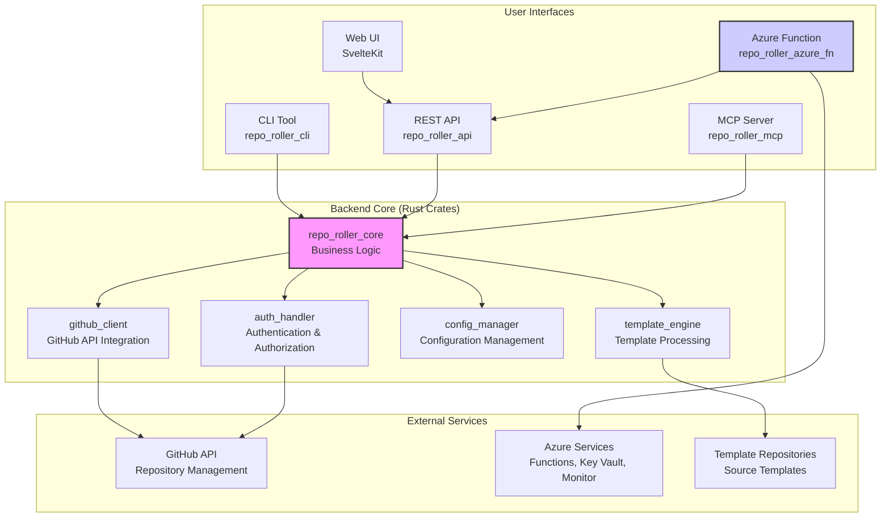
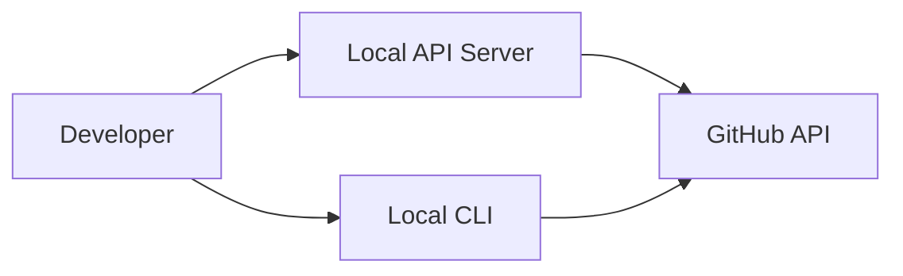
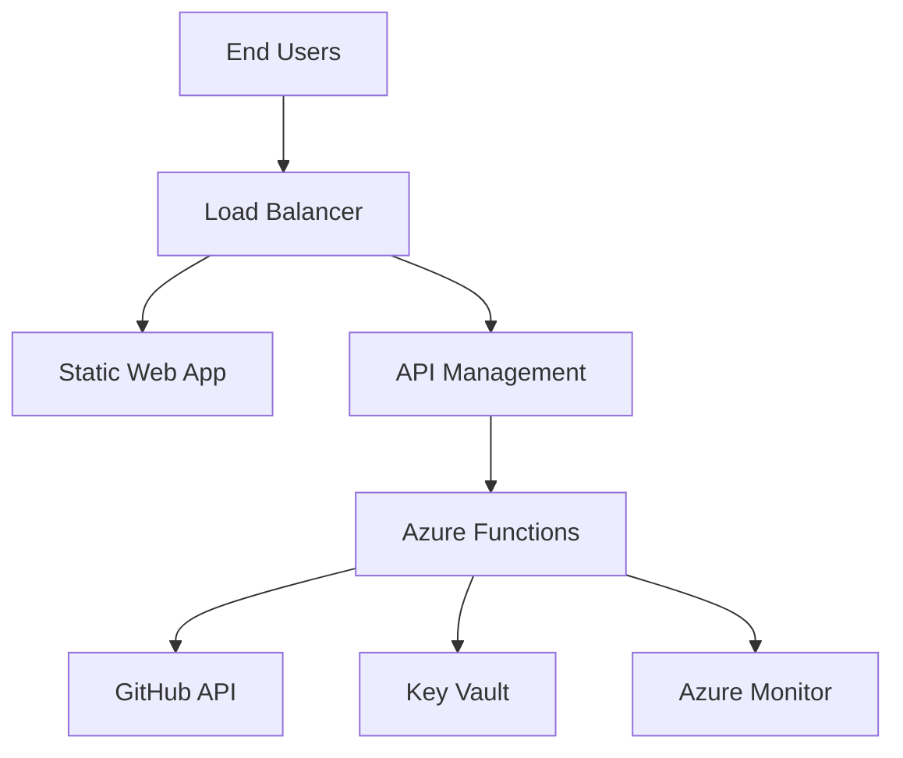
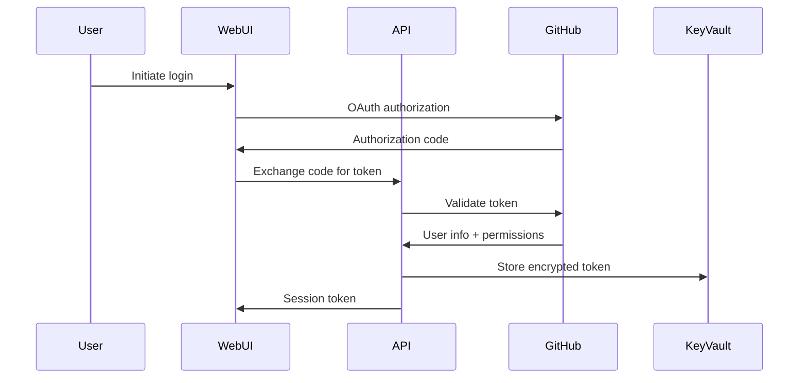

# System Overview

## High-Level Architecture

RepoRoller follows a modular, multi-tier architecture designed for flexibility, maintainability, and multiple deployment scenarios. The system separates concerns into distinct layers while providing multiple user interfaces for different interaction patterns.

## System Organization

### User Interfaces

Multiple interfaces support different user needs and integration scenarios:

**CLI Tool (`repo_roller_cli`)**

- Command-line interface for developers and automation
- Direct interaction with core business logic
- Ideal for scripting and CI/CD integration

**Web UI (SvelteKit)**

- Interactive web interface for guided repository creation
- Connects to REST API for backend operations
- Provides user-friendly forms and real-time feedback

**REST API (`repo_roller_api`)**

- HTTP-based programmatic interface
- Enables integration with external tools and services
- Supports both direct deployment and Azure Function hosting

**MCP Server (`repo_roller_mcp`)**

- Model Context Protocol interface for AI/LLM workflows
- Exposes repository creation as structured tools
- Enables AI agents to create repositories autonomously

**Azure Function Host (`repo_roller_azure_fn`)**

- Serverless deployment wrapper for the REST API
- Handles Azure-specific context and response formatting
- Enables cloud-native deployment with auto-scaling

### Business Logic Components

The core components contain all business logic and orchestration:

**Core Business Logic (`repo_roller_core`)**

- Central orchestration of repository creation workflow
- Coordinates interactions between all other components
- Defines primary data structures and interfaces
- Implements error handling and result reporting

### Application Services

Specialized services handle specific technical concerns:

**GitHub Client (`github_client`)**

- Abstracts all GitHub API interactions
- Handles authentication token management
- Provides typed interfaces for GitHub operations
- Manages rate limiting and error recovery

**Template Engine (`template_engine`)**

- Processes template repositories and variable substitution
- Handles file system operations and content transformation
- Supports advanced templating features (future: Handlebars)
- Manages template caching and optimization

**Configuration Manager (`config_manager`)**

- Loads and validates application configuration
- Manages template definitions and repository settings
- Handles environment-specific configuration
- Provides schema validation and defaults

**Authentication Handler (`auth_handler`)**

- Manages user authentication flows
- Implements role-based authorization
- Handles GitHub OAuth and token validation
- Provides session management for web interfaces

### External Service Integrations

The system integrates with several external services:

**GitHub API**

- Primary integration point for repository management
- Handles repository creation, configuration, and content
- Provides authentication and permission services

**Azure Services**

- **Azure Functions**: Serverless compute hosting
- **Azure Key Vault**: Secure credential storage
- **Azure Monitor**: Logging, metrics, and alerting

**Template Repositories**

- Source repositories containing template content
- Accessed via GitHub API for content retrieval
- Support for public and private template repositories

## Data Flow Architecture

### Request Processing Flow

1. **Request Initiation**
   - User submits repository creation request via any interface
   - Request includes repository name, template type, and variables

2. **Authentication & Authorization**
   - User credentials validated through appropriate mechanism
   - Permissions checked for target organization and repository

3. **Configuration Resolution**
   - Template configuration loaded from config management
   - Repository settings and policies retrieved
   - Variable defaults and validation rules applied

4. **Template Processing**
   - Template repository content retrieved and cached
   - Variable substitution performed on files and metadata
   - Content prepared for repository creation

5. **Repository Creation**
   - New repository created via GitHub API
   - Processed content pushed as initial commit
   - Repository settings and policies applied

6. **Result Reporting**
   - Success/failure status returned to user
   - Detailed logs and metrics recorded
   - Audit trail updated for compliance

### Error Handling Flow

The system implements comprehensive error handling at multiple levels:

**Request Level**

- Input validation and sanitization
- Authentication and authorization failures
- Rate limiting and quota management

**Processing Level**

- Template processing errors
- GitHub API failures and retries
- Configuration validation errors

**System Level**

- Service unavailability handling
- Resource exhaustion recovery
- Monitoring and alerting integration

## Deployment Architectures

### Development Deployment

### Production Deployment

## Scalability Considerations

### Horizontal Scaling

- **Stateless Design**: All components designed for stateless operation
- **Function Scaling**: Azure Functions automatically scale based on demand
- **API Gateway**: API Management provides load balancing and rate limiting

### Performance Optimization

- **Caching**: Template and configuration caching to reduce processing time
- **Async Processing**: Non-blocking operations for improved throughput
- **Resource Pooling**: Efficient resource utilization in serverless environment

### Rate Limit Management

- **GitHub API Limits**: Intelligent request batching and retry logic
- **User Rate Limits**: Per-user and per-organization request limiting
- **Monitoring**: Real-time monitoring of API usage and limits

## Security Architecture

### Authentication Flow

### Security Boundaries

- **Input Validation**: All user inputs validated and sanitized
- **Token Management**: Secure storage and rotation of GitHub tokens
- **Network Security**: HTTPS enforcement and network isolation
- **Audit Logging**: Comprehensive audit trail for all operations

This architecture provides a solid foundation for a scalable, maintainable, and secure repository automation system while supporting multiple deployment scenarios and user interaction patterns.
