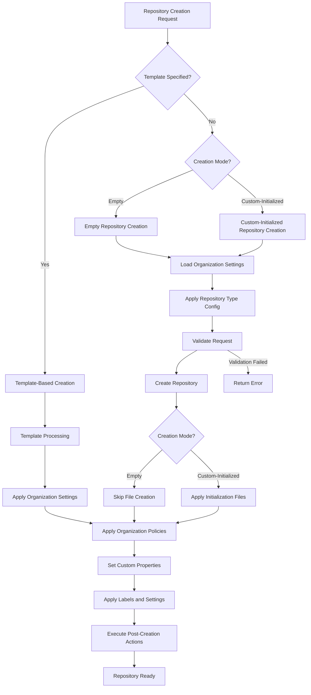

# Non-Template Repository Support Design

## Overview

The non-template repository support system enables users to create repositories without using templates while maintaining full integration with organization-specific settings, repository types, and governance policies. This design supports two distinct creation modes: truly empty repositories with no files, and custom-initialized repositories with user-selected files. Both modes ensure the same level of configuration management and compliance enforcement as template-based repositories.

## Repository Creation Modes

### Empty Repository Mode

Creates repositories with no files whatsoever, providing a completely blank slate. These repositories have no initial commit and contain only the repository metadata and settings.

### Custom-Initialized Repository Mode

Creates repositories with user-selected initialization files (README, .gitignore, LICENSE, etc.) but without using predefined templates. These repositories receive an initial commit containing only the user-specified files.

## Architecture

### Core Components

The non-template repository creation system extends the existing repository creation infrastructure:

```rust
pub struct NonTemplateRepositoryManager {
    config_manager: Arc<OrganizationSettingsManager>,
    github_client: Arc<dyn GitHubClient>,
    initialization_provider: Arc<dyn InitializationProvider>,
    repository_creator: Arc<RepositoryCreator>,
}

pub struct NonTemplateRepositoryRequest {
    pub repository_name: String,
    pub description: Option<String>,
    pub visibility: RepositoryVisibility,
    pub team: Option<String>,
    pub repository_type: Option<String>,
    pub organization: String,
    pub creation_mode: RepositoryCreationMode,
}

#[derive(Debug, Clone)]
pub enum RepositoryCreationMode {
    Empty, // Truly empty repository with no files
    CustomInitialized(InitializationOptions), // Repository with user-selected files
}

pub struct InitializationOptions {
    pub include_readme: bool,
    pub readme_content: Option<String>,
    pub include_gitignore: bool,
    pub gitignore_template: Option<String>,
    pub gitignore_custom_content: Option<String>,
    pub include_license: bool,
    pub license_type: Option<String>,
    pub custom_files: Vec<CustomFile>,
}

pub struct CustomFile {
    pub path: String,
    pub content: String,
    pub executable: bool,
}
```

### Integration with Repository Creation Workflow

Non-template repository creation integrates seamlessly with the existing workflow:



## Implementation Details

### Non-Template Repository Manager

The core manager coordinates all aspects of non-template repository creation:

```rust
impl NonTemplateRepositoryManager {
    pub async fn create_non_template_repository(
        &self,
        request: NonTemplateRepositoryRequest,
    ) -> Result<RepositoryCreationResult, RepositoryCreationError> {
        // 1. Load and validate organization settings
        let config_context = ConfigurationContext {
            organization: request.organization.clone(),
            team: request.team.clone(),
            repository_type: request.repository_type.clone(),
            template: match request.creation_mode {
                RepositoryCreationMode::Empty => "empty".to_string(),
                RepositoryCreationMode::CustomInitialized(_) => "custom-init".to_string(),
            },
            created_at: chrono::Utc::now(),
        };

        let merged_config = self.config_manager
            .resolve_configuration(&config_context)
            .await?;

        // 2. Validate request against organization policies
        self.validate_repository_request(&request, &merged_config).await?;

        // 3. Create the repository (no auto-init to maintain control)
        let repository = self.github_client
            .create_repository(&request.repository_name, &CreateRepositoryRequest {
                description: request.description.clone(),
                visibility: request.visibility,
                auto_init: false, // Always false - we control initialization
                ..Default::default()
            })
            .await?;

        // 4. Handle creation mode-specific logic
        match &request.creation_mode {
            RepositoryCreationMode::Empty => {
                // For empty repositories, skip all file creation
                // Repository remains truly empty with no commits
            }
            RepositoryCreationMode::CustomInitialized(init_options) => {
                // Create user-specified files and initial commit
                self.apply_custom_initialization(&repository, init_options).await?;
            }
        }

        // 5. Apply organization settings and policies (always applied regardless of mode)
        self.apply_organization_settings(&repository, &merged_config).await?;

        // 6. Set repository type custom property
        if let Some(repo_type) = &request.repository_type {
            self.apply_repository_type_property(&repository.full_name, Some(repo_type)).await?;
        }

        // 7. Execute post-creation actions
        self.execute_post_creation_actions(&repository, &merged_config).await?;

        Ok(RepositoryCreationResult {
            repository,
            applied_configuration: merged_config,
            creation_method: match request.creation_mode {
                RepositoryCreationMode::Empty => CreationMethod::Empty,
                RepositoryCreationMode::CustomInitialized(_) => CreationMethod::CustomInitialized,
            },
        })
    }

    async fn apply_custom_initialization(
        &self,
        repository: &Repository,
        options: &InitializationOptions,
    ) -> Result<(), RepositoryCreationError> {
        let mut files_to_create = Vec::new();

        // Add README if requested
        if options.include_readme {
            let content = if let Some(custom_content) = &options.readme_content {
                custom_content.clone()
            } else {
                self.initialization_provider
                    .create_readme(&ReadmeOptions {
                        repository_name: repository.name.clone(),
                        description: repository.description.clone(),
                        organization: repository.owner.login.clone(),
                        repository_type: None, // Will be filled from context
                        custom_content: None,
                    })
                    .await?
            };
            files_to_create.push(InitialFile {
                path: "README.md".to_string(),
                content,
                executable: false,
            });
        }

        // Add .gitignore if requested
        if options.include_gitignore {
            let content = if let Some(custom_content) = &options.gitignore_custom_content {
                custom_content.clone()
            } else if let Some(template) = &options.gitignore_template {
                self.initialization_provider
                    .get_gitignore_template(template)
                    .await?
            } else {
                return Err(RepositoryCreationError::InitializationFailed {
                    source: InitializationError::GitignoreTemplateRequired,
                });
            };
            files_to_create.push(InitialFile {
                path: ".gitignore".to_string(),
                content,
                executable: false,
            });
        }

        // Add LICENSE if requested
        if options.include_license {
            if let Some(license_type) = &options.license_type {
                let content = self.initialization_provider
                    .get_license_template(license_type)
                    .await?;
                files_to_create.push(InitialFile {
                    path: "LICENSE".to_string(),
                    content,
                    executable: false,
                });
            } else {
                return Err(RepositoryCreationError::InitializationFailed {
                    source: InitializationError::LicenseTypeRequired,
                });
            }
        }

        // Add custom files
        for custom_file in &options.custom_files {
            files_to_create.push(InitialFile {
                path: custom_file.path.clone(),
                content: custom_file.content.clone(),
                executable: custom_file.executable,
            });
        }

        // Create initial commit with all files (only if files were specified)
        if !files_to_create.is_empty() {
            self.initialization_provider
                .create_initial_commit(repository, files_to_create)
                .await?;
        }

        Ok(())
    }
}

        // Validate repository type exists
        if let Some(repo_type) = &request.repository_type {
            if !self.config_manager.is_repository_type_available(&request.organization, repo_type).await? {
                return Err(RepositoryCreationError::RepositoryTypeNotFound {
                    repo_type: repo_type.clone(),
                    organization: request.organization.clone(),
                });
            }
        }

        // Validate team membership if team specified
        if let Some(team) = &request.team {
            // TODO: Validate user has permission to create repos for this team
        }

        Ok(())
    }
}
```

### Initialization Provider

The initialization provider handles the creation of standard files and initial content:

```rust
#[async_trait]
pub trait InitializationProvider: Send + Sync {
    async fn create_initial_commit(&self, repository: &Repository, files: Vec<InitialFile>) -> Result<(), InitializationError>;
    async fn create_readme(&self, options: &ReadmeOptions) -> Result<String, InitializationError>;
    async fn get_gitignore_template(&self, language: &str) -> Result<String, InitializationError>;
    async fn get_license_template(&self, license_type: &str) -> Result<String, InitializationError>;
}

#[derive(Debug, Clone)]
pub struct InitialFile {
    pub content: String,
    pub executable: bool,
    pub path: String,
}

#[derive(Debug, Clone)]
pub struct ReadmeOptions {
    pub custom_content: Option<String>,
    pub description: Option<String>,
    pub organization: String,
    pub repository_name: String,
    pub repository_type: Option<String>,
}

impl InitializationProvider for DefaultInitializationProvider {
    async fn create_initial_commit(
        &self,
        repository: &Repository,
        files: Vec<InitialFile>
    ) -> Result<(), InitializationError> {
        // Create initial commit with specified files
        for file in files {
            self.github_client
                .create_or_update_file(
                    &repository.full_name,
                    &file.path,
                    &file.content,
                    "Initial commit",
                    None, // No existing SHA for new files
                )
                .await?;
        }
        Ok(())
    }

    async fn create_readme(&self, options: &ReadmeOptions) -> Result<String, InitializationError> {
        let mut content = if let Some(custom) = &options.custom_content {
            custom.clone()
        } else {
            // Generate default README content
            let mut readme = String::new();
            readme.push_str(&format!("# {}\n\n", options.repository_name));

            if let Some(desc) = &options.description {
                readme.push_str(&format!("{}\n\n", desc));
            }

            if let Some(repo_type) = &options.repository_type {
                readme.push_str(&format!("**Repository Type:** {}\n\n", repo_type));
            }

            readme.push_str("## Getting Started\n\n");
            readme.push_str("This repository was created using RepoRoller.\n\n");

            readme
        };

        Ok(content)
    }

    async fn get_gitignore_template(&self, language: &str) -> Result<String, InitializationError> {
        // Fetch gitignore template from GitHub's gitignore templates
        // or use built-in templates for common languages
        match language.to_lowercase().as_str() {
            "rust" => Ok(include_str!("../templates/gitignore/Rust.gitignore").to_string()),
            "javascript" | "typescript" | "node" => Ok(include_str!("../templates/gitignore/Node.gitignore").to_string()),
            "python" => Ok(include_str!("../templates/gitignore/Python.gitignore").to_string()),
            "java" => Ok(include_str!("../templates/gitignore/Java.gitignore").to_string()),
            _ => Err(InitializationError::TemplateNotFound {
                template_type: "gitignore".to_string(),
                language: language.to_string(),
            }),
        }
    }

    async fn get_license_template(&self, license_type: &str) -> Result<String, InitializationError> {
        // Return license templates
        match license_type.to_uppercase().as_str() {
            "MIT" => Ok(self.generate_mit_license().await?),
            "APACHE-2.0" => Ok(include_str!("../templates/licenses/Apache-2.0.txt").to_string()),
            "GPL-3.0" => Ok(include_str!("../templates/licenses/GPL-3.0.txt").to_string()),
            _ => Err(InitializationError::LicenseNotSupported {
                license_type: license_type.to_string(),
            }),
        }
    }
}
```

### CLI Integration

Non-template repository support integrates with the CLI through new flags and commands:

```rust
#[derive(Parser)]
#[command(name = "create")]
pub struct CreateCommand {
    /// Repository name
    pub name: String,

    /// Repository description
    #[arg(short, long)]
    pub description: Option<String>,

    /// Template to use (omit for non-template repository)
    #[arg(short, long)]
    pub template: Option<String>,

    /// Create truly empty repository (no files)
    #[arg(long, conflicts_with_all = ["template", "custom_init"])]
    pub empty: bool,

    /// Create custom-initialized repository (user-selected files)
    #[arg(long, conflicts_with_all = ["template", "empty"])]
    pub custom_init: bool,

    /// Repository type
    #[arg(long)]
    pub repository_type: Option<String>,

    /// Team to assign repository to
    #[arg(long)]
    pub team: Option<String>,

    /// Repository visibility
    #[arg(long, value_enum, default_value = "private")]
    pub visibility: RepositoryVisibility,

    /// Include README.md file (only for custom-init mode)
    #[arg(long, requires = "custom_init")]
    pub include_readme: bool,

    /// Custom README content (only for custom-init mode)
    #[arg(long, requires = "include_readme")]
    pub readme_content: Option<String>,

    /// Include .gitignore file (only for custom-init mode)
    #[arg(long, requires = "custom_init")]
    pub include_gitignore: bool,

    /// Gitignore template language (only for custom-init mode)
    #[arg(long, requires = "include_gitignore")]
    pub gitignore_language: Option<String>,

    /// Custom gitignore content (only for custom-init mode)
    #[arg(long, requires = "include_gitignore", conflicts_with = "gitignore_language")]
    pub gitignore_content: Option<String>,

    /// Include LICENSE file (only for custom-init mode)
    #[arg(long, requires = "custom_init")]
    pub include_license: bool,

    /// License type (only for custom-init mode)
    #[arg(long, requires = "include_license")]
    pub license_type: Option<String>,
}

impl CreateCommand {
    pub async fn execute(&self, context: &CliContext) -> Result<(), CliError> {
        if let Some(template) = &self.template {
            // Create from template (existing functionality)
            self.create_from_template(context, template).await
        } else if self.empty {
            // Create truly empty repository
            let request = NonTemplateRepositoryRequest {
                repository_name: self.name.clone(),
                description: self.description.clone(),
                visibility: self.visibility,
                team: self.team.clone(),
                repository_type: self.repository_type.clone(),
                organization: context.organization.clone(),
                creation_mode: RepositoryCreationMode::Empty,
            };

            let result = context.non_template_repository_manager
                .create_non_template_repository(request)
                .await?;

            println!("✅ Created empty repository: {}", result.repository.full_name);
            println!("🔗 URL: {}", result.repository.html_url);
            println!("📄 Files: None (truly empty)");

        } else if self.custom_init {
            // Create custom-initialized repository
            let init_options = InitializationOptions {
                include_readme: self.include_readme,
                readme_content: self.readme_content.clone(),
                include_gitignore: self.include_gitignore,
                gitignore_template: self.gitignore_language.clone(),
                gitignore_custom_content: self.gitignore_content.clone(),
                include_license: self.include_license,
                license_type: self.license_type.clone(),
                custom_files: Vec::new(), // Could be extended to support custom files
            };

            let request = NonTemplateRepositoryRequest {
                repository_name: self.name.clone(),
                description: self.description.clone(),
                visibility: self.visibility,
                team: self.team.clone(),
                repository_type: self.repository_type.clone(),
                organization: context.organization.clone(),
                creation_mode: RepositoryCreationMode::CustomInitialized(init_options),
            };

            let result = context.non_template_repository_manager
                .create_non_template_repository(request)
                .await?;

            println!("✅ Created custom-initialized repository: {}", result.repository.full_name);
            println!("🔗 URL: {}", result.repository.html_url);

            // Show which files were created
            let mut created_files = Vec::new();
            if self.include_readme { created_files.push("README.md"); }
            if self.include_gitignore { created_files.push(".gitignore"); }
            if self.include_license { created_files.push("LICENSE"); }

            if created_files.is_empty() {
                println!("📄 Files: None (custom-init mode but no files selected)");
            } else {
                println!("📄 Files: {}", created_files.join(", "));
            }

        } else {
            return Err(CliError::InvalidArguments {
                message: "Must specify either --template, --empty, or --custom-init".to_string(),
            });
        }

        Ok(())
    }
}
```

                organization: context.organization.clone(),
                initialization_options: InitializationOptions {
                    include_readme: self.include_readme,
                    readme_content: None,
                    include_gitignore: self.include_gitignore,
                    gitignore_template: self.gitignore_language.clone(),
                    include_license: self.include_license,
                    license_type: self.license_type.clone(),
                    create_initial_commit: true,
                },
            };

            let result = context.empty_repository_manager
                .create_empty_repository(request)
                .await?;

            println!("✅ Created empty repository: {}", result.repository.full_name);
            println!("🔗 URL: {}", result.repository.html_url);

        } else {
            // Create from template (existing functionality)
            // ... template-based creation logic
        }

        Ok(())
    }
}

```

### API Integration

REST API endpoints support empty repository creation:

```rust
#[derive(Deserialize)]
pub struct CreateEmptyRepositoryRequest {
    pub description: Option<String>,
    pub initialization: Option<InitializationOptions>,
    pub name: String,
    pub repository_type: Option<String>,
    pub team: Option<String>,
    pub visibility: RepositoryVisibility,
}

#[post("/repositories/empty")]
pub async fn create_empty_repository(
    request: Json<CreateEmptyRepositoryRequest>,
    context: web::Data<ApiContext>,
) -> Result<Json<RepositoryCreationResponse>, ApiError> {
    let empty_request = EmptyRepositoryRequest {
        repository_name: request.name.clone(),
        description: request.description.clone(),
        visibility: request.visibility,
        team: request.team.clone(),
        repository_type: request.repository_type.clone(),
        organization: context.organization.clone(),
        initialization_options: request.initialization.clone().unwrap_or_default(),
    };

    let result = context.empty_repository_manager
        .create_empty_repository(empty_request)
        .await
        .map_err(ApiError::from)?;

    Ok(Json(RepositoryCreationResponse::from(result)))
}
```

### MCP Integration

MCP server supports empty repository creation through tools:

```rust
#[derive(Deserialize)]
pub struct CreateEmptyRepositoryParams {
    pub description: Option<String>,
    pub gitignore_language: Option<String>,
    pub include_gitignore: Option<bool>,
    pub include_license: Option<bool>,
    pub include_readme: Option<bool>,
    pub license_type: Option<String>,
    pub name: String,
    pub repository_type: Option<String>,
    pub team: Option<String>,
    pub visibility: Option<String>,
}

impl McpServer {
    async fn handle_create_empty_repository(
        &self,
        params: CreateEmptyRepositoryParams,
    ) -> Result<Value, McpError> {
        let request = EmptyRepositoryRequest {
            repository_name: params.name,
            description: params.description,
            visibility: params.visibility
                .map(|v| v.parse())
                .transpose()?
                .unwrap_or(RepositoryVisibility::Private),
            team: params.team,
            repository_type: params.repository_type,
            organization: self.config.organization.clone(),
            initialization_options: InitializationOptions {
                include_readme: params.include_readme.unwrap_or(true),
                readme_content: None,
                include_gitignore: params.include_gitignore.unwrap_or(false),
                gitignore_template: params.gitignore_language,
                include_license: params.include_license.unwrap_or(false),
                license_type: params.license_type,
                create_initial_commit: true,
            },
        };

        let result = self.empty_repository_manager
            .create_empty_repository(request)
            .await?;

        Ok(json!({
            "repository": {
                "name": result.repository.name,
                "full_name": result.repository.full_name,
                "html_url": result.repository.html_url,
                "created_at": result.repository.created_at,
            },
            "creation_method": "empty",
            "applied_settings": {
                "repository_type": result.applied_configuration.repository_type,
                "team": result.applied_configuration.team,
            }
        }))
    }
}
```

## Error Handling

### Error Types

```rust
#[derive(Debug, thiserror::Error)]
pub enum RepositoryCreationError {
    #[error("Invalid repository name '{name}': {reason}")]
    InvalidRepositoryName { name: String, reason: String },

    #[error("Repository visibility '{requested}' not allowed: {policy}")]
    VisibilityNotAllowed { requested: RepositoryVisibility, policy: String },

    #[error("Repository type '{repo_type}' not found in organization '{organization}'")]
    RepositoryTypeNotFound { repo_type: String, organization: String },

    #[error("Team '{team}' not found or access denied")]
    TeamNotFound { team: String },

    #[error("Initialization failed: {source}")]
    InitializationFailed { #[from] source: InitializationError },

    #[error("Configuration error: {source}")]
    ConfigurationError { #[from] source: ConfigurationError },

    #[error("GitHub API error: {source}")]
    GitHubError { #[from] source: GitHubClientError },
}

#[derive(Debug, thiserror::Error)]
pub enum InitializationError {
    #[error("Template not found for {template_type}: {language}")]
    TemplateNotFound { template_type: String, language: String },

    #[error("License type '{license_type}' not supported")]
    LicenseNotSupported { license_type: String },

    #[error("Failed to create initial commit: {reason}")]
    CommitFailed { reason: String },

    #[error("File creation failed: {path} - {reason}")]
    FileCreationFailed { path: String, reason: String },
}
```

## Configuration Integration

### Organization Policy Enforcement

Empty repositories must respect all organization policies:

```rust
impl EmptyRepositoryManager {
    async fn apply_organization_settings(
        &self,
        repository: &Repository,
        config: &MergedConfiguration,
    ) -> Result<(), RepositoryCreationError> {
        // Apply repository settings
        if let Some(repo_settings) = &config.repository_settings {
            self.github_client
                .update_repository_settings(&repository.full_name, repo_settings)
                .await?;
        }

        // Apply branch protection
        if let Some(branch_protection) = &config.branch_protection {
            self.github_client
                .update_branch_protection(
                    &repository.full_name,
                    &branch_protection.default_branch,
                    branch_protection,
                )
                .await?;
        }

        // Apply labels
        for (_, label) in &config.labels {
            self.github_client
                .create_or_update_label(&repository.full_name, label)
                .await?;
        }

        // Install GitHub Apps
        for app in &config.github_apps {
            self.github_client
                .install_github_app(&repository.full_name, app)
                .await?;
        }

        // Add webhooks
        for webhook in &config.webhooks {
            self.github_client
                .create_webhook(&repository.full_name, webhook)
                .await?;
        }

        Ok(())
    }

    async fn ensure_required_files(
        &self,
        repository: &Repository,
        config: &MergedConfiguration,
    ) -> Result<(), RepositoryCreationError> {
        let mut required_files = Vec::new();

        // Check if organization requires specific files
        if config.requires_code_of_conduct {
            let content = self.get_organization_code_of_conduct(&repository.owner.login).await?;
            required_files.push(InitialFile {
                path: "CODE_OF_CONDUCT.md".to_string(),
                content,
                executable: false,
            });
        }

        if config.requires_contributing_guide {
            let content = self.get_organization_contributing_guide(&repository.owner.login).await?;
            required_files.push(InitialFile {
                path: "CONTRIBUTING.md".to_string(),
                content,
                executable: false,
            });
        }

        // Add required files
        if !required_files.is_empty() {
            self.initialization_provider
                .create_initial_commit(repository, required_files)
                .await?;
        }

        Ok(())
    }
}
```

## Testing Strategy

### Unit Testing

```rust
#[cfg(test)]
mod tests {
    use super::*;
    use mockall::predicate::*;

    #[tokio::test]
    async fn test_create_empty_repository_success() {
        let mut mock_github_client = MockGitHubClient::new();
        let mut mock_config_manager = MockOrganizationSettingsManager::new();
        let mut mock_init_provider = MockInitializationProvider::new();

        // Setup expectations
        mock_config_manager
            .expect_resolve_configuration()
            .with(predicate::always())
            .returning(|_| Ok(MergedConfiguration::default()));

        mock_github_client
            .expect_create_repository()
            .with(eq("test-repo"), predicate::always())
            .returning(|_, _| Ok(Repository::test_repository()));

        let manager = EmptyRepositoryManager {
            config_manager: Arc::new(mock_config_manager),
            github_client: Arc::new(mock_github_client),
            repository_creator: Arc::new(RepositoryCreator::new()),
            initialization_provider: Arc::new(mock_init_provider),
        };

        let request = EmptyRepositoryRequest {
            repository_name: "test-repo".to_string(),
            description: Some("Test repository".to_string()),
            visibility: RepositoryVisibility::Private,
            team: None,
            repository_type: None,
            organization: "test-org".to_string(),
            initialization_options: InitializationOptions::default(),
        };

        let result = manager.create_empty_repository(request).await;
        assert!(result.is_ok());
    }

    #[tokio::test]
    async fn test_repository_type_validation() {
        // Test repository type validation for empty repositories
    }

    #[tokio::test]
    async fn test_organization_policy_enforcement() {
        // Test that organization policies are enforced for empty repositories
    }
}
```

### Integration Testing

```rust
#[tokio::test]
async fn test_empty_repository_end_to_end() {
    let test_context = IntegrationTestContext::new().await;

    // Create empty repository through CLI
    let output = test_context
        .run_cli_command(&[
            "create",
            "test-empty-repo",
            "--empty",
            "--include-readme",
            "--include-gitignore",
            "--gitignore-language", "rust",
            "--repository-type", "library",
        ])
        .await
        .expect("CLI command should succeed");

    assert!(output.contains("Created empty repository"));

    // Verify repository was created correctly
    let repository = test_context
        .github_client
        .get_repository("test-org/test-empty-repo")
        .await
        .expect("Repository should exist");

    assert_eq!(repository.name, "test-empty-repo");

    // Verify files were created
    let files = test_context
        .github_client
        .list_repository_contents("test-org/test-empty-repo", "")
        .await
        .expect("Should list repository contents");

    let file_names: Vec<_> = files.iter().map(|f| &f.name).collect();
    assert!(file_names.contains(&"README.md"));
    assert!(file_names.contains(&".gitignore"));

    // Verify repository type custom property
    let properties = test_context
        .github_client
        .get_repository_custom_properties("test-org/test-empty-repo")
        .await
        .expect("Should get custom properties");

    assert_eq!(properties.get("repository_type"), Some(&"library".to_string()));
}
```

## Performance Considerations

### Optimization Strategies

1. **Initialization Caching**: Cache gitignore templates and license files to avoid repeated API calls
2. **Batch Operations**: Apply repository settings, labels, and properties in batches when possible
3. **Lazy Loading**: Load organization configurations only when needed
4. **Concurrent Operations**: Apply non-dependent settings concurrently

### Monitoring and Metrics

- Track empty repository creation success/failure rates
- Monitor creation time performance
- Track initialization option usage patterns
- Monitor organization policy compliance rates

## Security Considerations

### Access Control

- Validate user permissions for team assignment
- Enforce organization visibility policies
- Validate repository type permissions
- Apply security policies consistently

### Content Security

- Validate custom README content for security issues
- Ensure license templates are from trusted sources
- Sanitize user-provided descriptions and metadata
- Apply organization content policies

## Behavioral Assertions

1. Empty repository creation must complete successfully with zero files and no initial commit
2. Custom-initialized repository creation must complete successfully with only user-specified files
3. Organization-specific repository settings must apply to non-template repositories identically to templated repositories
4. Repository type configurations must apply to non-template repositories when type is specified
5. Empty repositories must remain truly empty (no files) unless organization policies require specific files
6. Custom-initialized repositories must contain only user-specified files plus any organization-required files
7. Required organization files must be added automatically regardless of creation mode or user preferences
8. Repository type custom properties must be set immediately upon repository creation for both modes
9. Post-creation actions must execute for non-template repositories with same reliability as templated repositories
10. Non-template repository creation must respect all organization visibility and security policies
11. Team assignments must be validated and applied correctly for non-template repositories
12. Audit logging must capture complete metadata including creation mode for all non-template repository creation events
13. Error handling must provide clear, actionable messages for all failure scenarios in both creation modes
14. Performance must meet established benchmarks for repository creation operations regardless of mode
15. CLI interface must clearly distinguish between empty and custom-initialized creation modes
16. API endpoints must validate creation mode parameters and reject invalid combinations
17. Custom file validation must occur before repository creation for custom-initialized mode
18. Empty mode must never create any files regardless of user initialization preferences
