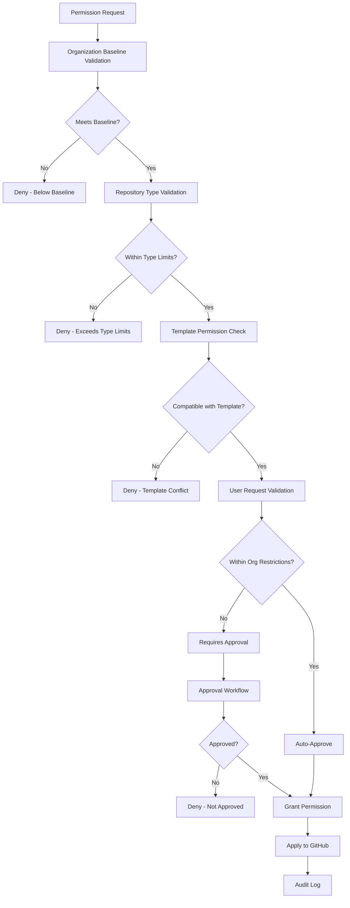

# Multi-Level Permissions System Design

## Overview

The multi-level permissions system provides a comprehensive framework for managing repository access permissions across organizational, repository type, template, and user levels. This design ensures consistent security governance while enabling flexible permission management that adapts to different organizational structures and compliance requirements.

## Architecture

### Core Components

The permissions system is built around several interconnected components that manage the permission hierarchy and enforcement:

```rust
pub struct PermissionManager {
    approval_workflow: Arc<ApprovalWorkflowManager>,
    audit_logger: Arc<PermissionAuditLogger>,
    compliance_monitor: Arc<ComplianceMonitor>,
    github_client: Arc<dyn GitHubClient>,
    permission_store: Arc<dyn PermissionStore>,
    policy_engine: Arc<PolicyEngine>,
}

pub struct PermissionHierarchy {
    pub organization_policies: OrganizationPermissionPolicies,
    pub repository_type_permissions: Option<RepositoryTypePermissions>,
    pub template_permissions: Option<TemplatePermissions>,
    pub user_requested_permissions: UserPermissionRequests,
}

pub struct PermissionRequest {
    pub duration: Option<PermissionDuration>,
    pub emergency_access: bool,
    pub justification: String,
    pub repository_context: RepositoryContext,
    pub requested_permissions: Vec<PermissionGrant>,
    pub requestor: UserId,
}

#[derive(Debug, Clone)]
pub struct PermissionGrant {
    pub conditions: Vec<PermissionCondition>,
    pub expiration: Option<chrono::DateTime<chrono::Utc>>,
    pub level: AccessLevel,
    pub permission_type: PermissionType,
    pub scope: PermissionScope,
}
```

### Permission Hierarchy Architecture

The system implements a strict hierarchy with clear precedence rules:



## Implementation Details

### Policy Engine

The policy engine evaluates permission requests against the hierarchy:

```rust
impl PolicyEngine {
    pub async fn evaluate_permission_request(
        &self,
        request: &PermissionRequest,
    ) -> Result<PermissionEvaluationResult, PermissionError> {
        // 1. Load complete permission hierarchy
        let hierarchy = self.load_permission_hierarchy(&request.repository_context).await?;

        // 2. Validate against organization baseline
        self.validate_organization_baseline(&request.requested_permissions, &hierarchy.organization_policies)?;

        // 3. Check repository type restrictions
        if let Some(repo_type_perms) = &hierarchy.repository_type_permissions {
            self.validate_repository_type_permissions(&request.requested_permissions, repo_type_perms)?;
        }

        // 4. Validate template compatibility
        if let Some(template_perms) = &hierarchy.template_permissions {
            self.validate_template_permissions(&request.requested_permissions, template_perms)?;
        }

        // 5. Check user request against organization restrictions
        let validation_result = self.validate_user_permissions(
            &request.requested_permissions,
            &hierarchy.organization_policies,
            &request.requestor,
        ).await?;

        // 6. Determine if approval is needed
        let requires_approval = validation_result.requires_approval || request.emergency_access;

        if requires_approval {
            Ok(PermissionEvaluationResult::RequiresApproval {
                approval_requirements: validation_result.approval_requirements,
                restricted_permissions: validation_result.restricted_permissions,
            })
        } else {
            Ok(PermissionEvaluationResult::Approved {
                granted_permissions: self.merge_permissions(&hierarchy, &request.requested_permissions)?,
                effective_duration: self.calculate_effective_duration(&request.duration, &hierarchy)?,
            })
        }
    }

    fn validate_organization_baseline(
        &self,
        requested: &[PermissionGrant],
        policies: &OrganizationPermissionPolicies,
    ) -> Result<(), PermissionError> {
        for baseline_requirement in &policies.baseline_requirements {
            if !self.permission_meets_baseline(requested, baseline_requirement) {
                return Err(PermissionError::BelowBaseline {
                    required: baseline_requirement.clone(),
                    requested: requested.to_vec(),
                });
            }
        }

        // Check against maximum restrictions
        for requested_perm in requested {
            if let Some(restriction) = policies.restrictions.get(&requested_perm.permission_type) {
                if !restriction.allows(&requested_perm.level) {
                    return Err(PermissionError::ExceedsOrganizationLimits {
                        permission: requested_perm.clone(),
                        restriction: restriction.clone(),
                    });
                }
            }
        }

        Ok(())
    }
}
```

### Organization Permission Policies

Organizations define comprehensive permission policies:

```rust
#[derive(Deserialize, Serialize, Debug, Clone)]
pub struct OrganizationPermissionPolicies {
    pub approval_workflows: HashMap<PermissionType, ApprovalWorkflow>,
    pub baseline_requirements: Vec<BaselinePermissionRequirement>,
    pub compliance_requirements: Vec<ComplianceRequirement>,
    pub emergency_access_policies: EmergencyAccessPolicies,
    pub restrictions: HashMap<PermissionType, PermissionRestriction>,
    pub role_templates: HashMap<String, RolePermissionTemplate>,
}

#[derive(Deserialize, Serialize, Debug, Clone)]
pub struct BaselinePermissionRequirement {
    pub applies_to: Vec<RepositoryVisibility>,
    pub conditions: Vec<PermissionCondition>,
    pub justification: String,
    pub minimum_level: AccessLevel,
    pub permission_type: PermissionType,
}

#[derive(Deserialize, Serialize, Debug, Clone)]
pub struct PermissionRestriction {
    pub approval_workflow: Option<String>,
    pub compliance_justification: String,
    pub maximum_level: AccessLevel,
    pub requires_approval: bool,
    pub restricted_scopes: Vec<PermissionScope>,
}

#[derive(Deserialize, Serialize, Debug, Clone)]
pub struct RolePermissionTemplate {
    pub automatic_assignment: Option<AutoAssignmentCriteria>,
    pub description: String,
    pub name: String,
    pub permissions: Vec<PermissionGrant>,
    pub restrictions: Vec<PermissionRestriction>,
}
```

### Repository Type Permissions

Repository types define specific permission requirements:

```rust
#[derive(Deserialize, Serialize, Debug, Clone)]
pub struct RepositoryTypePermissions {
    pub conditional_permissions: Vec<ConditionalPermission>,
    pub protection_requirements: ProtectionRequirements,
    pub recommended_permissions: Vec<PermissionGrant>,
    pub repository_type: String,
    pub required_permissions: Vec<PermissionGrant>,
    pub restricted_permissions: Vec<PermissionType>,
}

#[derive(Deserialize, Serialize, Debug, Clone)]
pub struct ConditionalPermission {
    pub condition: PermissionCondition,
    pub description: String,
    pub required_permissions: Vec<PermissionGrant>,
}

#[derive(Deserialize, Serialize, Debug, Clone)]
pub struct ProtectionRequirements {
    pub admin_enforcement: bool,
    pub branch_protection: Option<BranchProtectionLevel>,
    pub external_restrictions: Vec<ExternalRestriction>,
    pub required_reviews: Option<u32>,
}

impl RepositoryTypePermissions {
    pub async fn apply_to_repository(
        &self,
        repository: &Repository,
        github_client: &dyn GitHubClient,
    ) -> Result<AppliedPermissions, PermissionError> {
        let mut applied = Vec::new();

        // Apply required permissions
        for permission in &self.required_permissions {
            github_client.apply_repository_permission(repository, permission).await?;
            applied.push(permission.clone());
        }

        // Apply conditional permissions
        for conditional in &self.conditional_permissions {
            if conditional.condition.evaluate(repository)? {
                for permission in &conditional.required_permissions {
                    github_client.apply_repository_permission(repository, permission).await?;
                    applied.push(permission.clone());
                }
            }
        }

        // Apply protection requirements
        if let Some(branch_protection) = &self.protection_requirements.branch_protection {
            github_client.apply_branch_protection(repository, branch_protection).await?;
        }

        Ok(AppliedPermissions { permissions: applied })
    }
}
```

### Template Permission Management

Templates define permission patterns for repositories:

```rust
#[derive(Deserialize, Serialize, Debug, Clone)]
pub struct TemplatePermissions {
    pub collaborator_patterns: Vec<CollaboratorPattern>,
    pub external_integrations: Vec<ExternalIntegrationPermission>,
    pub inheritance_rules: PermissionInheritanceRules,
    pub recommended_permissions: Vec<PermissionGrant>,
    pub required_permissions: Vec<PermissionGrant>,
    pub template_name: String,
}

#[derive(Deserialize, Serialize, Debug, Clone)]
pub struct ExternalIntegrationPermission {
    pub approval_required: bool,
    pub integration_type: String,
    pub permission_requirements: Vec<PermissionGrant>,
    pub required_scopes: Vec<String>,
}

#[derive(Deserialize, Serialize, Debug, Clone)]
pub struct CollaboratorPattern {
    pub automatic_assignment: bool,
    pub conditions: Vec<PermissionCondition>,
    pub permissions: Vec<PermissionGrant>,
    pub role: String,
}

#[derive(Deserialize, Serialize, Debug, Clone)]
pub struct PermissionInheritanceRules {
    pub allow_user_modifications: bool,
    pub inherit_on_creation: bool,
    pub override_policy: InheritanceOverridePolicy,
    pub propagate_updates: bool,
}

impl TemplatePermissions {
    pub fn merge_with_user_request(
        &self,
        user_request: &UserPermissionRequests,
    ) -> Result<MergedPermissions, PermissionError> {
        let mut merged = self.required_permissions.clone();

        // Add recommended permissions if not conflicting
        for recommended in &self.recommended_permissions {
            if !self.conflicts_with_user_request(recommended, user_request) {
                merged.push(recommended.clone());
            }
        }

        // Merge user-requested permissions
        for user_perm in &user_request.permissions {
            if self.inheritance_rules.allow_user_modifications ||
               !self.is_template_managed_permission(&user_perm.permission_type) {
                merged.push(user_perm.clone());
            }
        }

        Ok(MergedPermissions {
            permissions: self.deduplicate_and_optimize(merged)?,
            source_trace: self.build_source_trace(user_request),
        })
    }
}
```

### Approval Workflow Management

The system supports configurable approval workflows:

```rust
pub struct ApprovalWorkflowManager {
    github_client: Arc<dyn GitHubClient>,
    notification_service: Arc<dyn NotificationService>,
    workflow_store: Arc<dyn WorkflowStore>,
}

#[derive(Deserialize, Serialize, Debug, Clone)]
pub struct ApprovalWorkflow {
    pub escalation_rules: Vec<EscalationRule>,
    pub name: String,
    pub notification_settings: NotificationSettings,
    pub stages: Vec<ApprovalStage>,
    pub timeout_policy: TimeoutPolicy,
}

#[derive(Deserialize, Serialize, Debug, Clone)]
pub struct ApprovalStage {
    pub approvers: ApproverSpecification,
    pub conditions: Vec<ApprovalCondition>,
    pub name: String,
    pub required_approvals: u32,
    pub timeout: chrono::Duration,
}

#[derive(Deserialize, Serialize, Debug, Clone)]
pub enum ApproverSpecification {
    Dynamic(ApproverQuery),
    Roles(Vec<String>),
    Teams(Vec<String>),
    Users(Vec<UserId>),
}

impl ApprovalWorkflowManager {
    pub async fn initiate_approval(
        &self,
        request: &PermissionRequest,
        workflow_name: &str,
    ) -> Result<ApprovalInstance, WorkflowError> {
        let workflow = self.workflow_store.get_workflow(workflow_name).await?;

        let instance = ApprovalInstance {
            id: Uuid::new_v4(),
            request: request.clone(),
            workflow: workflow.clone(),
            current_stage: 0,
            status: ApprovalStatus::Pending,
            created_at: chrono::Utc::now(),
            approvals: Vec::new(),
        };

        // Start first stage
        self.start_approval_stage(&instance, 0).await?;

        // Store instance
        self.workflow_store.save_approval_instance(&instance).await?;

        Ok(instance)
    }

    pub async fn process_approval(
        &self,
        instance_id: Uuid,
        approver: &UserId,
        decision: ApprovalDecision,
    ) -> Result<ApprovalResult, WorkflowError> {
        let mut instance = self.workflow_store.get_approval_instance(instance_id).await?;

        // Validate approver
        if !self.is_valid_approver(&instance, approver).await? {
            return Err(WorkflowError::UnauthorizedApprover {
                approver: approver.clone(),
                instance_id,
            });
        }

        // Record approval
        instance.approvals.push(Approval {
            approver: approver.clone(),
            decision: decision.clone(),
            timestamp: chrono::Utc::now(),
            comments: decision.comments.clone(),
        });

        // Check if stage is complete
        if self.is_stage_complete(&instance)? {
            if instance.current_stage + 1 >= instance.workflow.stages.len() {
                // Workflow complete
                instance.status = match decision.approved {
                    true => ApprovalStatus::Approved,
                    false => ApprovalStatus::Denied,
                };

                if instance.status == ApprovalStatus::Approved {
                    self.apply_approved_permissions(&instance.request).await?;
                }

                Ok(ApprovalResult::WorkflowComplete {
                    approved: decision.approved,
                    instance: instance.clone(),
                })
            } else {
                // Move to next stage
                instance.current_stage += 1;
                self.start_approval_stage(&instance, instance.current_stage).await?;

                Ok(ApprovalResult::StageComplete {
                    next_stage: instance.current_stage,
                })
            }
        } else {
            Ok(ApprovalResult::ApprovalRecorded)
        }
    }

    async fn start_approval_stage(
        &self,
        instance: &ApprovalInstance,
        stage_index: usize,
    ) -> Result<(), WorkflowError> {
        let stage = &instance.workflow.stages[stage_index];

        // Resolve approvers
        let approvers = self.resolve_approvers(&stage.approvers, &instance.request).await?;

        // Send notifications
        for approver in &approvers {
            self.notification_service.send_approval_request(
                approver,
                &instance.request,
                &stage,
            ).await?;
        }

        // Set timeout
        self.schedule_timeout(&instance.id, stage.timeout).await?;

        Ok(())
    }
}
```

### Permission Monitoring and Compliance

Continuous monitoring ensures permission compliance:

```rust
pub struct ComplianceMonitor {
    alert_manager: Arc<AlertManager>,
    audit_logger: Arc<PermissionAuditLogger>,
    metrics_collector: Arc<MetricsCollector>,
    permission_store: Arc<dyn PermissionStore>,
    policy_engine: Arc<PolicyEngine>,
}

impl ComplianceMonitor {
    async fn detect_permission_anomalies(
        &self,
        user_id: UserId,
        timeframe: TimeFrame,
    ) -> Result<Vec<PermissionAnomaly>, ComplianceError> {
        let mut anomalies = Vec::new();

        let usage_patterns = self.permission_store.get_permission_usage(user_id, timeframe).await?;
        let baseline_patterns = self.calculate_baseline_patterns(user_id).await?;

        // Detect unusual access patterns
        for permission in &usage_patterns.permissions_used {
            if !baseline_patterns.is_typical_usage(permission) {
                anomalies.push(PermissionAnomaly::UnusualAccess {
                    user_id,
                    permission: permission.clone(),
                    frequency: usage_patterns.get_frequency(permission),
                    baseline_frequency: baseline_patterns.get_frequency(permission),
                    risk_score: self.calculate_risk_score(permission, &usage_patterns),
                });
            }
        }

        // Detect dormant permissions
        for granted in &self.permission_store.get_user_permissions(user_id).await? {
            if !usage_patterns.has_used_permission(granted) {
                anomalies.push(PermissionAnomaly::DormantPermission {
                    user_id,
                    permission: granted.clone(),
                    granted_at: granted.granted_at,
                    last_used: usage_patterns.get_last_usage(granted),
                    recommendation: AnomalyRecommendation::ConsiderRevocation,
                });
            }
        }

        Ok(anomalies)
    }

    pub async fn run_compliance_scan(
        &self,
        scope: ComplianceScanScope,
    ) -> Result<ComplianceReport, ComplianceError> {
        let mut violations = Vec::new();
        let mut recommendations = Vec::new();

        match scope {
            ComplianceScanScope::Organization => {
                violations.extend(self.scan_organization_compliance().await?);
            }
            ComplianceScanScope::Repository(repo_id) => {
                violations.extend(self.scan_repository_compliance(repo_id).await?);
            }
            ComplianceScanScope::User(user_id) => {
                violations.extend(self.scan_user_compliance(user_id).await?);
            }
        }

        // Generate recommendations
        recommendations.extend(self.generate_compliance_recommendations(&violations).await?);

        let report = ComplianceReport {
            scan_id: Uuid::new_v4(),
            scope,
            timestamp: chrono::Utc::now(),
            violations,
            recommendations,
            overall_status: self.calculate_compliance_status(&violations),
        };

        // Alert on critical violations
        self.alert_on_critical_violations(&report).await?;

        Ok(report)
    }

    async fn scan_repository_compliance(
        &self,
        repository_id: RepositoryId,
    ) -> Result<Vec<ComplianceViolation>, ComplianceError> {
        let mut violations = Vec::new();

        let repository = self.permission_store.get_repository(repository_id).await?;
        let current_permissions = self.permission_store.get_repository_permissions(repository_id).await?;
        let expected_permissions = self.policy_engine.calculate_expected_permissions(&repository).await?;

        // Check for permission drift
        for expected in &expected_permissions {
            if !current_permissions.contains_equivalent(expected) {
                violations.push(ComplianceViolation::PermissionDrift {
                    repository_id,
                    expected: expected.clone(),
                    actual: current_permissions.find_closest(expected),
                    severity: self.calculate_drift_severity(expected),
                });
            }
        }

        // Check for excessive permissions
        for current in &current_permissions {
            if !expected_permissions.justifies_permission(current) {
                violations.push(ComplianceViolation::ExcessivePermissions {
                    repository_id,
                    permission: current.clone(),
                    justification_required: true,
                });
            }
        }

        // Check for expired permissions
        violations.extend(self.find_expired_permissions(repository_id).await?);

        Ok(violations)
    }
}
```

### GitHub Integration

Deep integration with GitHub's permission system:

```rust
#[async_trait]
pub trait GitHubPermissionClient: Send + Sync {
    async fn add_repository_collaborator(
        &self,
        repository_full_name: &str,
        username: &str,
        permission_level: GitHubPermissionLevel,
    ) -> Result<(), GitHubError>;

    async fn apply_repository_permission(
        &self,
        repository: &Repository,
        permission: &PermissionGrant,
    ) -> Result<(), GitHubError>;

    async fn get_repository_collaborators(
        &self,
        repository_full_name: &str,
    ) -> Result<Vec<Collaborator>, GitHubError>;

    async fn install_github_app_permissions(
        &self,
        repository_full_name: &str,
        app_permissions: &GitHubAppPermissions,
    ) -> Result<(), GitHubError>;

    async fn update_team_repository_permission(
        &self,
        org: &str,
        team_slug: &str,
        repository_full_name: &str,
        permission: GitHubPermissionLevel,
    ) -> Result<(), GitHubError>;
}

impl GitHubPermissionClient for GitHubClient {
    async fn apply_repository_level_permission(
        &self,
        repository: &Repository,
        permission: &PermissionGrant,
    ) -> Result<(), GitHubError> {
        match permission.permission_type {
            PermissionType::BranchProtection => {
                let protection_rules = self.convert_to_github_protection(permission)?;
                self.update_branch_protection(
                    &repository.full_name,
                    &repository.default_branch,
                    &protection_rules,
                ).await
            }
            PermissionType::IssueManagement => {
                self.update_repository_settings(
                    &repository.full_name,
                    &RepositorySettings {
                        has_issues: permission.level >= AccessLevel::Write,
                        ..Default::default()
                    },
                ).await
            }
            PermissionType::SecurityAdvisories => {
                self.update_repository_security_settings(
                    &repository.full_name,
                    &SecuritySettings {
                        security_advisories_enabled: true,
                        vulnerability_reporting_enabled: permission.level >= AccessLevel::Write,
                    },
                ).await
            }
        }
    }

    async fn apply_repository_permission(
        &self,
        repository: &Repository,
        permission: &PermissionGrant,
    ) -> Result<(), GitHubError> {
        match &permission.scope {
            PermissionScope::Repository => {
                self.apply_repository_level_permission(repository, permission).await
            }
            PermissionScope::Team(team_name) => {
                self.apply_team_repository_permission(repository, team_name, permission).await
            }
            PermissionScope::User(username) => {
                self.apply_user_repository_permission(repository, username, permission).await
            }
            PermissionScope::GitHubApp(app_id) => {
                self.apply_github_app_permission(repository, *app_id, permission).await
            }
        }
    }
}
```

## Configuration File Formats

### Organization Permission Policies

```toml
# organizations/{org}/permissions/policies.toml

[baseline_requirements]
[[baseline_requirements.permissions]]
permission_type = "repository_read"
minimum_level = "read"
applies_to = ["private", "public", "internal"]
justification = "All repositories require basic read access for organization members"

[[baseline_requirements.permissions]]
permission_type = "security_advisories"
minimum_level = "read"
applies_to = ["private", "internal"]
justification = "Security compliance requires advisory access"

[restrictions]
[restrictions.admin_access]
maximum_level = "admin"
requires_approval = true
approval_workflow = "admin_access_approval"
compliance_justification = "SOX compliance requires admin access approval"

[restrictions.external_collaborators]
maximum_level = "write"
restricted_scopes = ["security_advisories", "admin_settings"]
requires_approval = true

[role_templates]
[role_templates.developer]
name = "Standard Developer"
description = "Standard access for development team members"
permissions = [
    { permission_type = "repository_read", level = "read", scope = "repository" },
    { permission_type = "repository_write", level = "write", scope = "repository" },
    { permission_type = "issue_management", level = "write", scope = "repository" },
]

[role_templates.maintainer]
name = "Repository Maintainer"
description = "Elevated access for repository maintainers"
permissions = [
    { permission_type = "repository_admin", level = "admin", scope = "repository" },
    { permission_type = "branch_protection", level = "admin", scope = "repository" },
    { permission_type = "security_advisories", level = "write", scope = "repository" },
]

[emergency_access]
enabled = true
max_duration_hours = 4
requires_justification = true
automatic_revocation = true
notification_channels = ["security-alerts", "audit-log"]
```

### Repository Type Permissions

```toml
# types/library/permissions.toml

[required_permissions]
[[required_permissions]]
permission_type = "security_advisories"
level = "write"
scope = "repository"
justification = "Libraries require security advisory management"

[[required_permissions]]
permission_type = "branch_protection"
level = "admin"
scope = "repository"
conditions = [{ type = "branch_name", value = "main" }]

[recommended_permissions]
[[recommended_permissions]]
permission_type = "repository_admin"
level = "admin"
scope = "team"
conditions = [{ type = "team_role", value = "maintainer" }]

[restricted_permissions]
types = ["external_collaborator_admin", "disable_security_features"]
justification = "Libraries have enhanced security requirements"

[conditional_permissions]
[[conditional_permissions]]
condition = { type = "visibility", value = "public" }
required_permissions = [
    { permission_type = "code_scanning", level = "admin", scope = "repository" },
    { permission_type = "dependency_scanning", level = "admin", scope = "repository" },
]
description = "Public libraries require mandatory security scanning"

[protection_requirements]
branch_protection = "strict"
required_reviews = 2
admin_enforcement = true
external_restrictions = ["no_force_push", "require_signed_commits"]
```

### Template Permissions

```toml
# templates/microservice/permissions.toml

[template]
name = "microservice"
version = "1.0.0"

[required_permissions]
[[required_permissions]]
permission_type = "repository_write"
level = "write"
scope = "team"
justification = "Microservices require team write access for CI/CD"

[[required_permissions]]
permission_type = "environments"
level = "admin"
scope = "repository"
conditions = [{ type = "environment_name", value = "production" }]

[external_integrations]
[[external_integrations]]
integration_type = "ci_cd_pipeline"
required_scopes = ["actions:write", "deployments:write"]
permission_requirements = [
    { permission_type = "actions", level = "write", scope = "repository" },
    { permission_type = "deployments", level = "write", scope = "repository" },
]
approval_required = false

[[external_integrations]]
integration_type = "monitoring_service"
required_scopes = ["repository:read", "issues:write"]
permission_requirements = [
    { permission_type = "repository_read", level = "read", scope = "external_service" },
    { permission_type = "issue_management", level = "write", scope = "external_service" },
]
approval_required = true

[collaborator_patterns]
[[collaborator_patterns]]
role = "developer"
permissions = [
    { permission_type = "repository_write", level = "write", scope = "repository" },
    { permission_type = "issue_management", level = "write", scope = "repository" },
]
automatic_assignment = true
conditions = [{ type = "team_membership", value = "development" }]

[inheritance_rules]
inherit_on_creation = true
allow_user_modifications = true
propagate_updates = false
override_policy = "user_preference"
```

## Testing Strategy

### Unit Testing

```rust
#[cfg(test)]
mod tests {
    use super::*;
    use mockall::predicate::*;

    #[tokio::test]
    async fn test_permission_hierarchy_validation() {
        let mut mock_store = MockPermissionStore::new();
        let policy_engine = PolicyEngine::new(Arc::new(mock_store));

        // Setup organization baseline
        let org_policies = OrganizationPermissionPolicies {
            baseline_requirements: vec![
                BaselinePermissionRequirement {
                    permission_type: PermissionType::RepositoryRead,
                    minimum_level: AccessLevel::Read,
                    applies_to: vec![RepositoryVisibility::Private],
                    conditions: vec![],
                    justification: "Baseline read access".to_string(),
                }
            ],
            restrictions: HashMap::new(),
            role_templates: HashMap::new(),
            approval_workflows: HashMap::new(),
            compliance_requirements: vec![],
            emergency_access_policies: EmergencyAccessPolicies::default(),
        };

        // Test permission request below baseline
        let request = PermissionRequest {
            repository_context: RepositoryContext::test_context(),
            requested_permissions: vec![], // No permissions requested
            justification: "Test request".to_string(),
            duration: None,
            requestor: UserId::new("test-user"),
            emergency_access: false,
        };

        let result = policy_engine.evaluate_permission_request(&request).await;
        assert!(result.is_err());
        assert!(matches!(result.unwrap_err(), PermissionError::BelowBaseline { .. }));
    }

    #[tokio::test]
    async fn test_approval_workflow() {
        let workflow_manager = ApprovalWorkflowManager::new_for_test();

        let request = PermissionRequest::test_request();
        let instance = workflow_manager.initiate_approval(&request, "admin_approval").await.unwrap();

        // Test approval process
        let result = workflow_manager.process_approval(
            instance.id,
            &UserId::new("approver1"),
            ApprovalDecision::approved("Approved for testing"),
        ).await.unwrap();

        assert!(matches!(result, ApprovalResult::WorkflowComplete { approved: true, .. }));
    }

    #[tokio::test]
    async fn test_compliance_monitoring() {
        let compliance_monitor = ComplianceMonitor::new_for_test();

        let report = compliance_monitor.run_compliance_scan(
            ComplianceScanScope::Repository(RepositoryId::new("test-repo"))
        ).await.unwrap();

        assert!(report.violations.is_empty());
        assert_eq!(report.overall_status, ComplianceStatus::Compliant);
    }
}
```

### Integration Testing

```rust
#[tokio::test]
async fn test_end_to_end_permission_management() {
    let test_context = IntegrationTestContext::new().await;

    // Create repository with template permissions
    let repository = test_context.create_repository_with_template("microservice").await;

    // Verify template permissions were applied
    let permissions = test_context.get_repository_permissions(&repository.full_name).await;
    assert!(permissions.has_permission(PermissionType::RepositoryWrite, AccessLevel::Write));

    // Request additional permissions
    let request = PermissionRequest {
        repository_context: RepositoryContext::from_repository(&repository),
        requested_permissions: vec![
            PermissionGrant {
                permission_type: PermissionType::RepositoryAdmin,
                level: AccessLevel::Admin,
                scope: PermissionScope::User("test-user".to_string()),
                conditions: vec![],
                expiration: None,
            }
        ],
        justification: "Need admin access for repository configuration".to_string(),
        duration: Some(PermissionDuration::Hours(24)),
        requestor: UserId::new("test-user"),
        emergency_access: false,
    };

    // Submit permission request
    let result = test_context.permission_manager.request_permissions(request).await.unwrap();

    // Verify approval workflow was triggered
    assert!(matches!(result, PermissionRequestResult::ApprovalRequired { .. }));

    // Approve request
    let approval_result = test_context.approve_permission_request(result.approval_id()).await.unwrap();
    assert!(approval_result.approved);

    // Verify permissions were applied
    let updated_permissions = test_context.get_repository_permissions(&repository.full_name).await;
    assert!(updated_permissions.has_permission(PermissionType::RepositoryAdmin, AccessLevel::Admin));
}
```

## Security Considerations

### Permission Escalation Prevention

- Strict hierarchy enforcement prevents lower levels from exceeding higher-level restrictions
- All permission grants validated against organization baseline and restrictions
- Approval workflows required for sensitive permission elevations
- Regular audits detect and alert on permission anomalies

### Data Protection

- Permission data encrypted at rest and in transit
- Access to permission management restricted to authorized administrators
- Audit logs protected against tampering with cryptographic signatures
- Sensitive permission operations require multi-factor authentication

## Performance Optimization

### Caching Strategy

- Organization policies cached with TTL-based invalidation
- Permission evaluations cached for frequently accessed repositories
- Approval workflow state cached for active instances
- GitHub API responses cached to reduce rate limit impact

### Scalability Measures

- Asynchronous permission application to avoid blocking repository creation
- Batch processing for bulk permission operations
- Database optimization for permission queries and history
- Horizontal scaling support for high-volume organizations

## Behavioral Assertions

1. Organization baseline permissions must be enforced as the minimum for all repositories regardless of other specifications
2. Repository type permissions must be validated against organization restrictions before application
3. Template permission inheritance must respect the complete permission hierarchy
4. User permission requests must trigger approval workflows when exceeding organization restrictions
5. Permission validation must complete within 200ms for standard requests under normal load
6. Emergency access must be automatically revoked according to configured policies
7. Compliance violations must trigger immediate alerts and remediation workflows
8. Permission changes must be logged with complete audit trails including justification
9. External system integrations must maintain permission consistency and security boundaries
10. Approval workflows must handle timeout and escalation scenarios correctly
11. Permission anomaly detection must identify unusual access patterns and dormant permissions
12. GitHub integration must maintain bidirectional synchronization of permission state
13. Bulk permission operations must be processed efficiently without blocking other operations
14. System failures must not result in permission escalation or unauthorized access grants
15. Permission data must be backed up with point-in-time recovery capabilities
