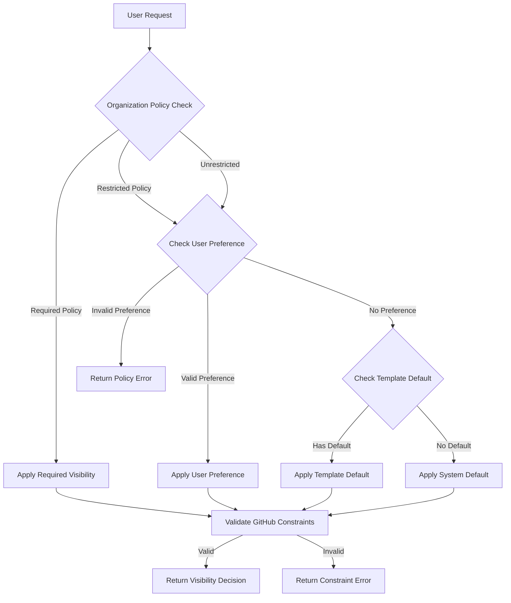

# Repository Visibility Handling Design

## Overview

The repository visibility handling system manages the complex decision-making process for determining repository visibility during creation. It implements a hierarchical policy system that balances organizational security requirements, user preferences, and GitHub platform constraints.

## Architecture

### Core Components

The visibility handling system consists of several key components working together:

```rust
pub struct VisibilityResolver {
    cache: Arc<RwLock<PolicyCache>>,
    github_detector: Arc<dyn GitHubEnvironmentDetector>,
    policy_provider: Arc<dyn VisibilityPolicyProvider>,
}

pub struct VisibilityDecision {
    constraints_applied: Vec<PolicyConstraint>,
    source: DecisionSource,
    visibility: RepositoryVisibility,
}

#[derive(Debug, Clone, PartialEq)]
pub enum RepositoryVisibility {
    Internal, // Only available in GitHub Enterprise
    Private,
    Public,
}
```

### Visibility Resolution Workflow

The visibility resolution follows a clear hierarchy:



## Implementation Details

### Visibility Policy Provider

The policy provider manages organization-specific visibility policies:

```rust
#[async_trait]
pub trait VisibilityPolicyProvider: Send + Sync {
    async fn get_organization_policy(&self, org: &str) -> Result<OrganizationVisibilityPolicy, Error>;
    async fn invalidate_cache(&self, org: &str) -> Result<(), Error>;
}

#[derive(Debug, Clone)]
pub struct OrganizationVisibilityPolicy {
    pub enforcement_level: PolicyEnforcementLevel,
    pub last_updated: chrono::DateTime<chrono::Utc>,
    pub required_visibility: Option<RepositoryVisibility>,
    pub restricted_visibilities: Vec<RepositoryVisibility>,
}

#[derive(Debug, Clone, PartialEq)]
pub enum PolicyEnforcementLevel {
    Required(RepositoryVisibility),
    Restricted(Vec<RepositoryVisibility>),
    Unrestricted,
}
```

### GitHub Environment Detection

The GitHub environment detector determines platform capabilities:

```rust
#[async_trait]
pub trait GitHubEnvironmentDetector: Send + Sync {
    async fn get_plan_limitations(&self, org: &str) -> Result<PlanLimitations, Error>;
    async fn is_enterprise_environment(&self, org: &str) -> Result<bool, Error>;
}

#[derive(Debug, Clone)]
pub struct PlanLimitations {
    pub private_repo_limit: Option<u32>,
    pub supports_internal_repos: bool,
    pub supports_private_repos: bool,
}
```

### Visibility Resolution Logic

The core resolution logic implements the hierarchical decision process:

```rust
impl VisibilityResolver {
    pub async fn resolve_visibility(
        &self,
        request: &VisibilityRequest,
    ) -> Result<VisibilityDecision, VisibilityError> {
        // 1. Get organization policy
        let org_policy = self.policy_provider
            .get_organization_policy(&request.organization)
            .await?;

        // 2. Check for required policy enforcement
        if let PolicyEnforcementLevel::Required(visibility) = org_policy.enforcement_level {
            return self.validate_and_build_decision(
                visibility,
                DecisionSource::OrganizationPolicy,
                &request,
            ).await;
        }

        // 3. Check user preference against restrictions
        if let Some(user_visibility) = request.user_preference {
            if self.is_visibility_allowed(&user_visibility, &org_policy) {
                return self.validate_and_build_decision(
                    user_visibility,
                    DecisionSource::UserPreference,
                    &request,
                ).await;
            } else {
                return Err(VisibilityError::PolicyViolation {
                    requested: user_visibility,
                    policy: org_policy.enforcement_level,
                });
            }
        }

        // 4. Fall back to template default
        if let Some(template_visibility) = request.template_default {
            if self.is_visibility_allowed(&template_visibility, &org_policy) {
                return self.validate_and_build_decision(
                    template_visibility,
                    DecisionSource::TemplateDefault,
                    &request,
                ).await;
            }
        }

        // 5. Use system default
        let system_default = RepositoryVisibility::Private;
        self.validate_and_build_decision(
            system_default,
            DecisionSource::SystemDefault,
            &request,
        ).await
    }

    async fn validate_and_build_decision(
        &self,
        visibility: RepositoryVisibility,
        source: DecisionSource,
        request: &VisibilityRequest,
    ) -> Result<VisibilityDecision, VisibilityError> {
        // Validate against GitHub constraints
        let constraints = self.validate_github_constraints(&visibility, &request.organization).await?;

        Ok(VisibilityDecision {
            visibility,
            source,
            constraints_applied: constraints,
        })
    }

    async fn validate_github_constraints(
        &self,
        visibility: &RepositoryVisibility,
        organization: &str,
    ) -> Result<Vec<PolicyConstraint>, VisibilityError> {
        let limitations = self.github_detector.get_plan_limitations(organization).await?;
        let mut constraints = Vec::new();

        match visibility {
            RepositoryVisibility::Internal => {
                if !self.github_detector.is_enterprise_environment(organization).await? {
                    return Err(VisibilityError::GitHubConstraint {
                        message: "Internal repositories are only available in GitHub Enterprise".to_string(),
                    });
                }
                constraints.push(PolicyConstraint::RequiresEnterprise);
            }
            RepositoryVisibility::Private => {
                if !limitations.supports_private_repos {
                    return Err(VisibilityError::GitHubConstraint {
                        message: "Private repositories are not available on this plan".to_string(),
                    });
                }
                constraints.push(PolicyConstraint::RequiresPaidPlan);
            }
            RepositoryVisibility::Public => {
                // Public repositories are always available
            }
        }

        Ok(constraints)
    }
}
```

### Error Handling

Comprehensive error handling provides clear guidance:

```rust
#[derive(Debug, thiserror::Error)]
pub enum VisibilityError {
    #[error("Cache error: {message}")]
    CacheError { message: String },

    #[error("GitHub API error during validation: {source}")]
    GitHubApiError { source: github_client::Error },

    #[error("GitHub constraint violation: {message}")]
    GitHubConstraint { message: String },

    #[error("Organization policy not found for: {organization}")]
    PolicyNotFound { organization: String },

    #[error("Policy violation: requested {requested:?} but organization policy requires {policy:?}")]
    PolicyViolation {
        requested: RepositoryVisibility,
        policy: PolicyEnforcementLevel,
    },
}
```

### Caching Strategy

Intelligent caching improves performance while maintaining accuracy:

```rust
#[derive(Debug)]
pub struct PolicyCache {
    max_age: chrono::Duration,
    policies: HashMap<String, CachedPolicy>,
}

#[derive(Debug, Clone)]
pub struct CachedPolicy {
    cached_at: chrono::DateTime<chrono::Utc>,
    policy: OrganizationVisibilityPolicy,
}

impl PolicyCache {
    pub fn get(&self, org: &str) -> Option<&OrganizationVisibilityPolicy> {
        if let Some(cached) = self.policies.get(org) {
            if chrono::Utc::now() - cached.cached_at < self.max_age {
                return Some(&cached.policy);
            }
        }
        None
    }

    pub fn insert(&mut self, org: String, policy: OrganizationVisibilityPolicy) {
        self.policies.insert(org, CachedPolicy {
            policy,
            cached_at: chrono::Utc::now(),
        });
    }

    pub fn invalidate(&mut self, org: &str) {
        self.policies.remove(org);
    }
}
```

## Configuration Integration

### Organization Policy Configuration

Visibility policies are defined in the organization metadata repository:

```toml
# global/defaults.toml
[repository_visibility]
enforcement_level = "restricted"  # "required", "restricted", "unrestricted"
required_visibility = "private"   # Only used when enforcement_level = "required"
restricted_visibilities = ["public"]  # Prohibited options when enforcement_level = "restricted"
default_visibility = "private"    # Fallback when no other preference specified

# Override settings
override_allowed = false  # Whether teams can override this policy
```

### Template Visibility Configuration

Templates can specify default visibility in their metadata:

```toml
# .reporoller/template.toml
[repository]
default_visibility = "private"
description = "This template creates private repositories by default"

[visibility_requirements]
# Template can specify constraints
minimum_visibility = "private"  # Template requires at least private visibility
reason = "Contains sensitive configuration templates"
```

## Security Considerations

### Policy Enforcement

- **Immutable Organization Policies**: Core security policies cannot be overridden by users or templates
- **Audit Logging**: All visibility decisions and policy violations are logged
- **Policy Validation**: Policies are validated before storage and application
- **Tamper Detection**: Policy changes are tracked and require appropriate authorization

### Data Protection

- **Cache Security**: Cached policies are stored securely and invalidated appropriately
- **API Security**: GitHub API calls use proper authentication and respect rate limits
- **Error Information**: Error messages provide guidance without exposing sensitive policy details

## Performance Optimizations

### Cache Strategy

- **Policy Caching**: Organization policies are cached for 5 minutes by default
- **GitHub Environment Caching**: Enterprise detection results cached for 1 hour
- **Intelligent Invalidation**: Cache invalidation triggered by policy updates
- **Concurrent Access**: Thread-safe cache implementation supports concurrent requests

### API Optimization

- **Batch Validation**: Multiple visibility decisions can be validated in a single API call when possible
- **Rate Limit Respect**: Built-in rate limiting and back-off for GitHub API calls
- **Connection Pooling**: Reuse HTTP connections for multiple API requests
- **Lazy Loading**: GitHub environment detection only performed when needed

## Edge Cases and Error Handling

### Policy Conflicts

1. **Organization Policy Changes During Creation**
   - Cache invalidation triggers re-validation
   - Creation process retries with updated policies
   - Clear error messages when policies become incompatible

2. **Cross-Organization Templates**
   - Visibility policies from target organization take precedence
   - Template default visibility validated against target org policies
   - Clear error messages for policy conflicts

3. **GitHub API Failures**
   - Graceful degradation when GitHub API is unavailable
   - Cached policy information used when possible
   - Retry logic with exponential back-off for transient failures

### GitHub Platform Constraints

1. **Enterprise Detection Failures**
   - Conservative fallback (assume non-Enterprise)
   - Clear error messages when internal repositories are requested on github.com
   - Retry logic for API failures during environment detection

2. **Plan Limitation Changes**
   - Regular refresh of plan limitation information
   - Graceful handling when plan limitations change mid-creation
   - Clear error messages explaining plan-specific constraints

## Integration Points

### Repository Creation Workflow

The visibility resolver integrates with the main repository creation workflow:

1. **Pre-Creation Validation**: Visibility resolved before any GitHub API calls
2. **Repository Settings**: Visibility setting passed to repository creation payload
3. **Post-Creation Verification**: Verification that repository visibility was set correctly
4. **Error Recovery**: Rollback procedures if visibility setting fails

### Configuration Management

Integration with the broader configuration system:

1. **Policy Loading**: Organization policies loaded from metadata repositories
2. **Template Integration**: Template visibility defaults loaded from template metadata
3. **Cache Coordination**: Coordination with other configuration caches for consistency
4. **Update Notifications**: Real-time updates when policies change

## Testing Strategy

### Unit Testing

- **Policy Resolution Logic**: Comprehensive test coverage for all resolution scenarios
- **Error Handling**: Tests for all error conditions and edge cases
- **Cache Behavior**: Tests for cache hits, misses, and invalidation scenarios
- **GitHub Constraint Validation**: Tests for all GitHub platform constraints

### Integration Testing

- **End-to-End Workflows**: Complete repository creation with various visibility scenarios
- **GitHub API Integration**: Tests with real GitHub API (using test organizations)
- **Policy Enforcement**: Verification that organization policies are properly enforced
- **Performance Testing**: Cache performance and API response time validation

## Acceptance Criteria

### Core Functionality

1. **Policy Hierarchy**: Organization policies override user preferences and template defaults
2. **GitHub Constraints**: Internal repositories only available in Enterprise environments
3. **Error Messages**: Clear, actionable error messages for all failure scenarios
4. **Performance**: Visibility resolution completes within performance requirements

### Security

1. **Policy Enforcement**: Organization security policies cannot be bypassed
2. **Audit Logging**: All visibility decisions logged for security review
3. **Cache Security**: Cached policies properly secured and invalidated

### Reliability

1. **API Resilience**: Graceful handling of GitHub API failures and rate limits
2. **Cache Consistency**: Cache invalidation maintains data consistency
3. **Concurrent Safety**: Thread-safe operation under concurrent load

## Behavioral Assertions

1. Organization visibility policies must be enforced regardless of user or template preferences
2. Internal repository visibility must only be allowed in GitHub Enterprise environments
3. Policy cache must be invalidated when organization policies change
4. GitHub API rate limits must be respected during visibility validation
5. Visibility resolution must be deterministic for the same input parameters
6. All policy violations must be detected before repository creation begins
7. Cache misses must not cause repository creation failures
8. Template visibility defaults must be validated against organization policies
9. Cross-organization visibility conflicts must be detected and reported clearly
10. Visibility decision source must be clearly tracked for audit purposes
