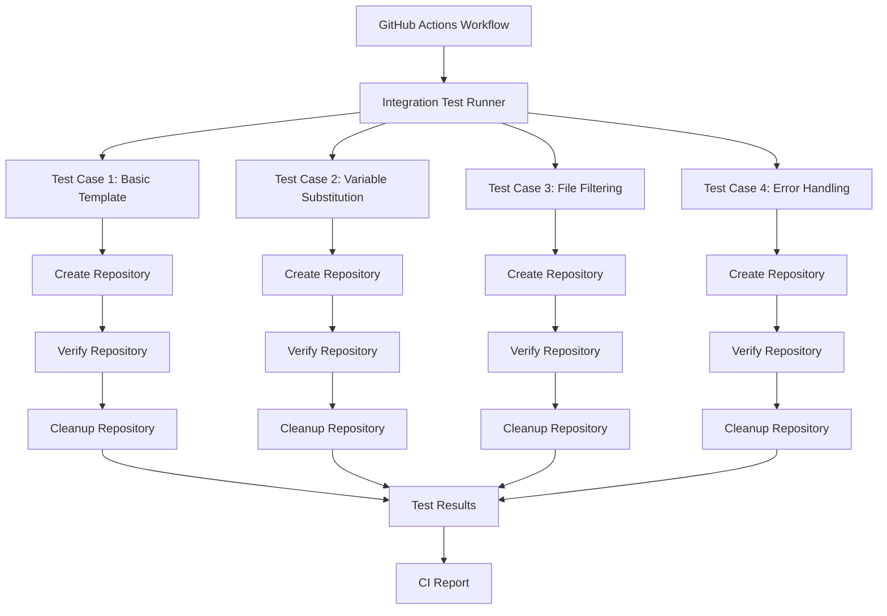
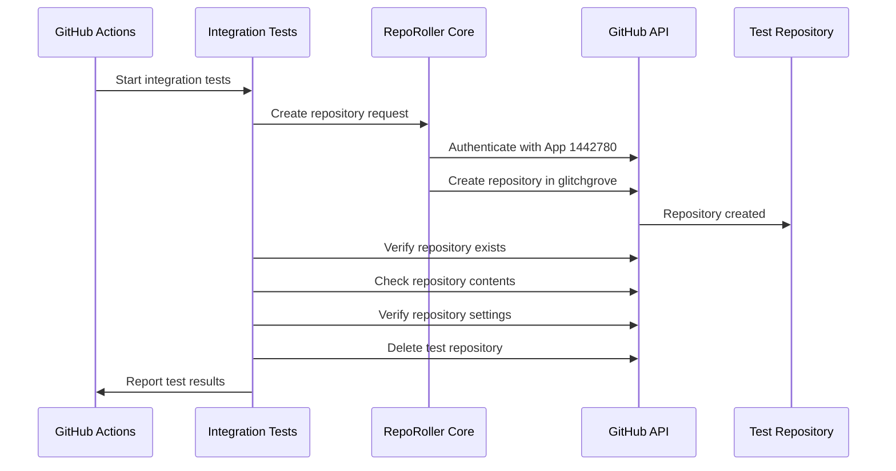
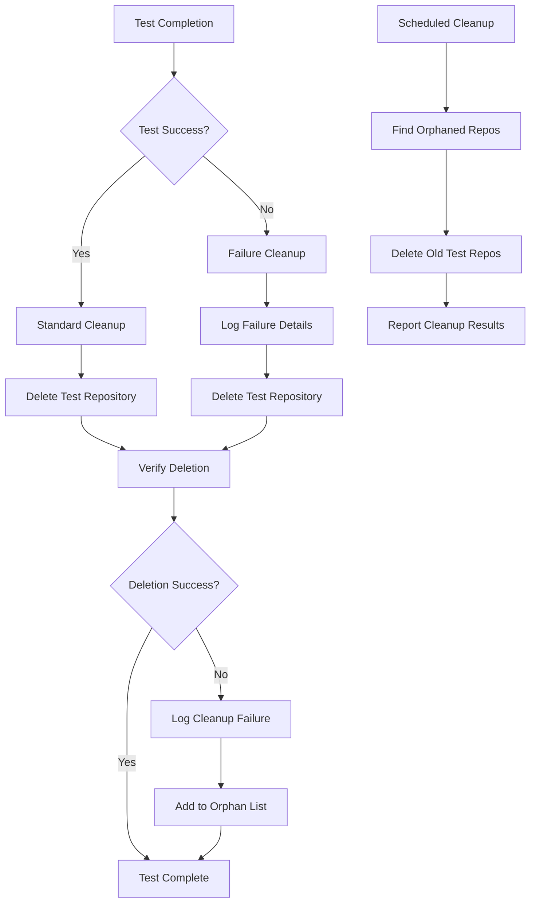

# Automated Testing Strategy for RepoRoller

## Problem Description

RepoRoller currently has comprehensive unit tests but lacks integration testing that validates the complete end-to-end workflow. We need automated CI-based testing that:

1. Creates actual repositories in the glitchgrove organization
2. Verifies all aspects of the application functionality
3. Cleans up test repositories after verification
4. Covers different template scenarios and edge cases

## Surrounding Context

**Current State:**

- Existing CI with unit tests, doc tests, and coverage reporting
- GitHub App (ID: 1442780) with admin permissions in glitchgrove org
- Template engine with variable substitution and file filtering
- Dependency injection architecture enabling testability
- One test template repository already exists: `glitchgrove/template-test`

**Constraints:**

- Must not interfere with existing CI workflows
- Should be cost-effective (minimize GitHub API usage)
- Must reliably clean up test artifacts
- Should provide clear failure diagnostics

## Proposed Solution

### Design Goals

1. **Comprehensive Coverage**: Test all major application components end-to-end
2. **Reliable Cleanup**: Ensure no test repositories are left behind
3. **Fast Feedback**: Complete integration tests within reasonable time limits
4. **Maintainable**: Easy to add new test scenarios and debug failures
5. **Isolated**: Tests don't interfere with each other or production usage

### Design Constraints

1. **GitHub API Limits**: Respect rate limiting and minimize API calls
2. **CI Runtime**: Keep total test time under 10 minutes
3. **Repository Naming**: Use clear, timestamped naming to avoid conflicts
4. **Permissions**: Use existing GitHub App with admin permissions
5. **Parallel Safety**: Tests must be safe to run concurrently

### Design Decisions

1. **Single GitHub App**: Use existing app (1442780) for both creation and deletion
2. **Dedicated Test Crate**: Create `integration_tests` crate for end-to-end tests
3. **Repository Naming Convention**: `test-repo-roller-{timestamp}-{test-name}`
4. **Cleanup Strategy**: Always-run cleanup step with comprehensive error handling
5. **Test Data**: Create multiple template repositories for different scenarios

### Alternatives Considered

1. **Separate Cleanup App**: Decided against for simplicity, existing app has sufficient permissions
2. **Mock GitHub API**: Rejected as it wouldn't test real GitHub integration
3. **Local Git Testing**: Insufficient as it doesn't test GitHub-specific features
4. **Manual Testing**: Not scalable and doesn't integrate with CI

## Design

### Architecture



### Data Flow



### Module Breakdown

#### 1. Integration Test Crate (`crates/integration_tests`)

**Purpose**: Contains all end-to-end test scenarios
**Dependencies**:

- `repo_roller_core`
- `github_client`
- `template_engine`
- `tokio-test`
- `tempfile`

**Key Components**:

- `test_runner.rs` - Main test orchestration
- `test_cases/` - Individual test scenarios
- `fixtures/` - Test data and configurations
- `utils/` - Helper functions for setup/cleanup

#### 2. Test Template Repositories

**Required Templates in glitchgrove org**:

- `template-basic` - Simple template with minimal variables
- `template-variables` - Complex variable substitution scenarios
- `template-filtering` - File inclusion/exclusion patterns
- `template-binary` - Mixed text and binary files
- `template-nested` - Deep directory structures

#### 3. GitHub Actions Workflow (`integration-tests.yml`)

**Triggers**:

- Pull requests to master
- Manual workflow dispatch
- Nightly scheduled runs

**Environment Variables**:

- `GITHUB_APP_ID`: 1442780
- `GITHUB_APP_PRIVATE_KEY`: Stored in secrets
- `TEST_ORG`: glitchgrove

#### 4. Repository Cleanup Service

**Features**:

- Cleanup on test completion (success or failure)
- Orphaned repository detection and cleanup
- Rate limiting and retry logic
- Comprehensive error logging

### Test Scenarios

#### Test Case 1: Basic Repository Creation

```rust
#[tokio::test]
async fn test_basic_repository_creation() {
    // Create repository from template-basic
    // Verify repository exists with correct settings
    // Check default files are present
    // Cleanup
}
```

#### Test Case 2: Variable Substitution

```rust
#[tokio::test]
async fn test_variable_substitution() {
    // Use template-variables with complex substitutions
    // Verify all variables are correctly replaced
    // Check built-in variables are populated
    // Cleanup
}
```

#### Test Case 3: File Filtering

```rust
#[tokio::test]
async fn test_file_filtering() {
    // Use template-filtering with include/exclude patterns
    // Verify correct files are processed
    // Check binary files are preserved
    // Cleanup
}
```

#### Test Case 4: Error Handling

```rust
#[tokio::test]
async fn test_error_scenarios() {
    // Test invalid template sources
    // Test missing required variables
    // Test GitHub API failures
    // Verify appropriate error messages
}
```

### Implementation Plan

#### Phase 1: Foundation (Week 1)

1. Create `integration_tests` crate structure
2. Implement basic test runner and cleanup utilities
3. Create GitHub Actions workflow
4. Set up test secrets and environment

#### Phase 2: Test Templates (Week 1-2)

1. Create test template repositories in glitchgrove
2. Design template content for different scenarios
3. Document template variable requirements
4. Test template fetching manually

#### Phase 3: Core Test Cases (Week 2)

1. Implement basic repository creation test
2. Add variable substitution verification
3. Create file filtering test scenarios
4. Implement error handling tests

#### Phase 4: Advanced Features (Week 3)

1. Add performance benchmarking
2. Implement parallel test execution
3. Create comprehensive cleanup service
4. Add detailed reporting and diagnostics

#### Phase 5: Integration & Refinement (Week 3-4)

1. Integrate with existing CI pipeline
2. Add test result reporting
3. Performance optimization
4. Documentation and maintenance guides

### Repository Naming Strategy

**Format**: `test-repo-roller-{timestamp}-{test-case}-{random}`
**Example**: `test-repo-roller-20240108-120000-basic-a1b2c3`

**Benefits**:

- Unique names prevent conflicts
- Timestamp enables orphan detection
- Test case name aids debugging
- Random suffix handles concurrent runs

### Cleanup Strategy



### Error Handling & Diagnostics

1. **Comprehensive Logging**: All API calls, file operations, and test steps
2. **Failure Artifacts**: Save repository state before cleanup on failures
3. **Retry Logic**: Automatic retry for transient GitHub API failures
4. **Health Checks**: Verify GitHub App permissions before tests
5. **Resource Monitoring**: Track API rate limits and repository quotas

## Conclusion

This comprehensive testing strategy will provide:

- **End-to-end validation** of all RepoRoller functionality
- **Automated cleanup** preventing test artifact accumulation
- **Scalable test framework** for adding new scenarios
- **Integration with existing CI** without disruption
- **Clear failure diagnostics** for rapid issue resolution

The design leverages the existing GitHub App permissions, maintains separation of concerns, and provides a robust foundation for continuous integration testing of the RepoRoller application.

**Confidence Rating: 8/10** - High confidence in the overall approach and architecture. The main uncertainties are around GitHub API rate limiting behavior and optimal test execution timing, which can be refined during implementation.
